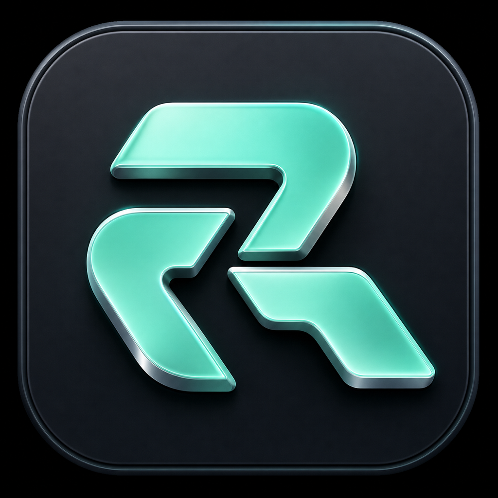

<p align="center">
  
</p>

# RoundRelay

Repository: `roundrelay`

RoundRelay is a local-first desktop workspace for bringing multiple local AI Agent CLIs into one conversation. It discovers the Agent CLIs already available on your computer, lets you organize them into persistent groups, and coordinates their work without requiring a hosted orchestration service.

The name combines repeated discussion rounds with explicit handoffs: different local Agents inherit, challenge, and advance the same task while the user keeps control of the shared context.
Its Relay Fold mark turns that handoff into a folded ribbon: separate paths meet, change direction, and continue as one recognizable `R` without implying that collaboration is limited to three Agents.

The first release has a strict boundary: Agent execution, orchestration, groups, and conversation state stay on the user's machine. Network access is limited to explicit user actions: model providers, guided installer downloads, and credential-free HTTPS links opened in the operating-system browser. RoundRelay does not support remote participants or cloud channels.

## Core Capabilities

- Discover installed Agent CLIs without exposing their executable paths to the renderer.
- Guide first-run users through a three-step carousel while the desktop client completes local Agent detection.
- Create persistent local Agent groups and continue conversations across app restarts.
- Bring heterogeneous local Agents into one manual or bounded automatic discussion, with each Agent keeping its own native session reference.
- Reference validated local Skills with `@` and route each selection only to its intended Agent.
- Attach PNG, JPEG, or WebP images through the system picker or clipboard paste, with per-Agent capability checks before any run starts.
- Run Agent turns through a constrained Electron bridge instead of giving the web UI shell access.
- Request read-only/plan modes by default where the Agent adapter can enforce them, with explicit write opt-in; adapters without an enforceable mode are labeled as Agent-managed permissions.
- Install supported missing Agents through fixed, allowlisted flows.
- Configure compatible OpenAI-style providers with credentials protected by the operating system.
- Keep all participants, groups, and conversation history on the local device.

## Supported Agents

| Agent | Local detection | Guided installation | Provider behavior |
| --- | --- | --- | --- |
| Codex | Yes | macOS and Windows | Uses its own Responses-compatible configuration |
| Hermes | Yes | macOS and Windows | Supports an OpenAI-compatible provider |
| OpenClaw | Yes | macOS and Windows | Supports a managed OpenAI-compatible provider |
| WorkBuddy | Yes | macOS and Windows | Experimental OpenAI-compatible provider support |
| Kimi Code | Yes | macOS and Windows | Uses its existing local configuration |
| Claude Code | Yes | macOS and Windows | Uses its existing Anthropic-compatible configuration |
| Qwen Code | Yes | macOS and Windows | Supports an OpenAI-compatible provider |
| Gemini CLI | Yes | macOS and Windows | Uses its existing local authentication and provider settings |
| OpenCode | Yes | macOS and Windows | Uses its existing local provider settings |

Agent availability still depends on each upstream CLI, operating-system support, authentication requirements, and version compatibility. Guided installers execute only fixed, allowlisted package names or download URLs.

## Privacy And Architecture

RoundRelay consists of a Vue frontend and an Electron desktop shell:

```text
Vue renderer
    | validated preload APIs
Electron main process
    |-- Agent discovery and execution
    |-- local group and message storage
    |-- local Skill discovery and validation
    |-- private image attachment storage and previews
    |-- provider credential storage
    `-- user-authorized provider and installer network access
```

The Electron main process owns filesystem paths, child processes, Agent configuration, and persistence. The renderer receives a deliberately narrow API surface and does not receive raw executable paths, attachment paths, native Agent session references, or provider secrets. Skill results contain sanitized coordinates and display names; attachment messages contain safe metadata, while bounded previews are requested separately by attachment ID.

Local workspace data and imported image copies are stored under Electron's per-user application-data directory. Provider credentials use Electron `safeStorage`; if operating-system encryption is unavailable, RoundRelay refuses to persist them in plaintext. RoundRelay does not create cloud channels or connect remote participants. Network activity occurs only when the user configures a model provider, invokes an Agent that uses its own provider, starts a guided installation, or explicitly opens a credential-free HTTPS link in the operating-system browser.

## Development

Prerequisites:

- Node.js 20.19 or newer for repository scripts and CI; the desktop runtime uses the Node.js version bundled with Electron
- npm
- macOS for the currently configured release packaging targets

Install dependencies:

```bash
npm --prefix frontend ci
npm --prefix desktop ci
```

Run the renderer-only development preview:

```bash
npm --prefix frontend run dev
```

The browser preview cannot execute Agents because it intentionally has no Electron bridge. It is a UI development surface, not a supported web or PWA product.

Run the Electron application:

```bash
npm --prefix desktop run dev
```

The desktop command builds the frontend in desktop mode before starting Electron.

## Tests And Builds

```bash
# Frontend unit tests
npm --prefix frontend test

# Static renderer validation and the Electron renderer build
npm --prefix frontend run build
npm --prefix frontend run build:desktop

# Electron main-process and bridge tests
npm --prefix desktop test

# Unpacked desktop package validation
npm --prefix desktop run pack
```

For a macOS release build:

```bash
npm --prefix desktop run dist
```

Generated packages are written to `desktop/dist/` and are not committed.

## Repository Layout

```text
frontend/   Vue renderer bundled into Electron, plus a bridge-free UI preview
desktop/    Electron main process, preload bridge, local Agent runtime, and tests
documentation/  Architecture, permissions, variables, flows, automation, and test map
.github/    Continuous integration workflows
```

The review entry point is [`documentation/architecture.md`](documentation/architecture.md).

## Project Status

RoundRelay is under active private development. Local Agent discovery, first-run onboarding, persistent direct/group conversations, guarded heterogeneous-Agent execution, `@` Skill references, image picker/paste attachments, provider storage, frontend tests, desktop tests, and macOS package generation are implemented. Real-Agent image/Skill compatibility still requires a target-device matrix, and Windows discovery and installation paths require release-device validation before a supported Windows distribution is declared.

Current macOS packages use ad-hoc signing for local validation. A public distribution still requires an Apple Developer ID and notarization.

There is currently no public release or open-source license.
