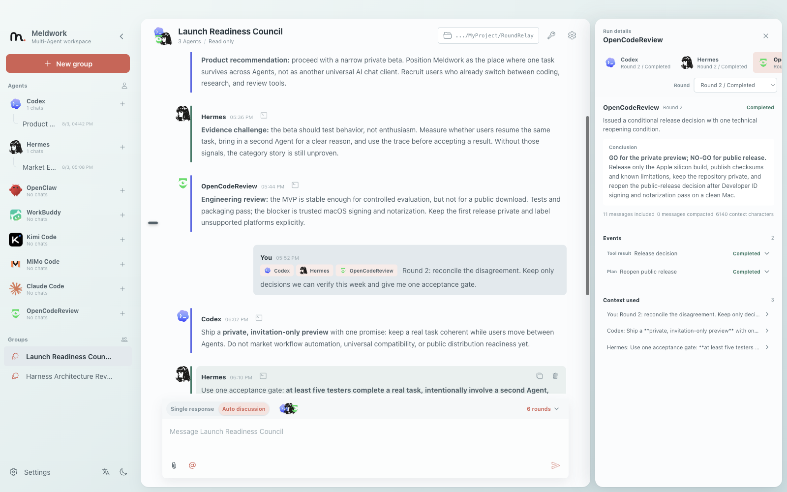
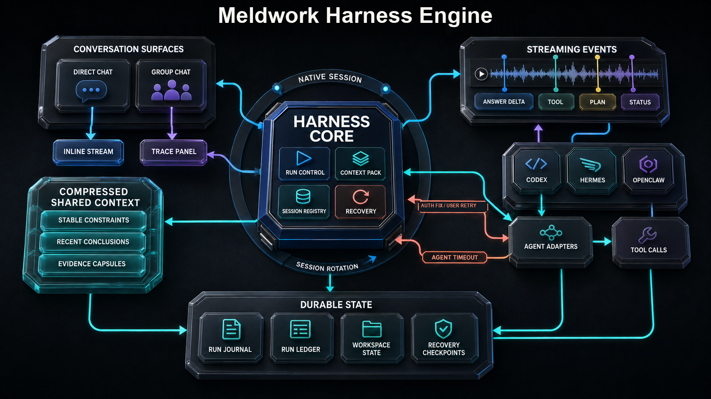

<p align="center">
  
</p>

<p align="center">
  <strong>English</strong> · <a href="README.zh-CN.md">简体中文</a>
</p>

# AI agents are interchangeable. Your work should not be.

**Meldwork is a local-first desktop workspace for persistent direct Agent conversations and bounded multi-Agent review. Each conversation keeps its own context, permissions, attachments, compatible native sessions, and sanitized execution history on your computer.**

Most Agent tools are already good at completing one step. The fragile part starts when work crosses tools: context gets copied by hand, files are attached again, permission boundaries drift, and the final answer can look complete without showing how it was formed. Meldwork keeps the task stable while Agents change. Start with one Agent, add another only when the work needs a different capability or an independent challenge, then inspect the result before deciding what to keep.

Meldwork is not about opening more AI windows. It is about letting complex work move between Agents without losing the thread: one Agent's conclusions and evidence can support the next step, every answer returns to the same task context, and you decide which results are worth accepting.

<p align="center">
  <a href="https://github.com/Ryder-MHumble/Meldwork/releases/download/v0.1.0-private-preview.2/Meldwork-0.1.0-arm64.dmg"><strong>Download the macOS DMG</strong></a>
  · <a href="LICENSE">AGPL-3.0 license</a>
  · <a href="COMMERCIAL_USE.md">Commercial use</a>
</p>

## Install the desktop client

The current desktop build is for Apple silicon Macs.

1. Open the [latest GitHub Release](https://github.com/Ryder-MHumble/Meldwork/releases/tag/v0.1.0-private-preview.2).
2. Download `Meldwork-0.1.0-arm64.dmg`.
3. Drag Meldwork into Applications and open it.
4. Connect the supported Agent CLIs already installed on your computer, or configure an independent Provider profile for an Agent.

If the latest Release includes a DMG, it can be downloaded and installed locally. Developers can also run Meldwork from source with the commands below.

## Start with one repeatable workflow

The first public workflow is simple: produce a deliverable, have a second Agent challenge it, and let the human decide what to keep.

1. Create a group with two locally ready Agents.
2. Attach only the files needed for the task and keep workspace write access off unless the task requires it.
3. Ask one Agent to produce the deliverable and the other to check assumptions, omissions, and evidence in a bounded discussion.
4. Inspect the final replies and sanitized run trace before accepting, revising, or discarding the result.

Other domains are examples, not separate product promises. The release is successful when this two-Agent review loop works predictably on a clean Apple silicon Mac.

## One place to see the work


Direct conversations and working groups live in the same desktop workspace. Start directly when one Agent is enough; create a group when the task needs an independent check. Meldwork does not currently merge separate conversation histories automatically, so attach or restate the context the group must share.

## From a first answer to a reviewed decision

| Step | What happens in Meldwork |
| --- | --- |
| Start | Open a direct conversation with the Agent best suited to the first step |
| Escalate | Create a working group and select only the Agents that should participate |
| Discuss | Run a manual handoff or a bounded automatic multi-round discussion |
| Verify | Inspect final replies, status, source context, and sanitized execution traces before accepting the result |



The conversation remains readable while Agent-specific process details stay available on demand. Group runs preserve compact evidence for later Agents and for the human making the final decision.

## The Harness behind the workspace



The Harness is the layer that keeps Agent collaboration from turning into copied prompts and disconnected transcripts. It normalizes Agent events, builds bounded context for each target, keeps compatible native sessions separate, checkpoints local run state, and exposes recovery states when authentication or compatibility needs user action.

- **Run control:** explicit targets, manual handoffs, bounded automatic rounds, stop, and per-Agent controls.
- **Context control:** stable constraints, selected files, target-scoped Skills and knowledge sources, recent conclusions, and compact evidence capsules.
- **Inspectable execution:** conclusions, source context, warnings, terminal status, and, when exposed by the selected Agent or transport, plans and tool lifecycle summaries.
- **Durable local state:** conversations and bounded run records remain inspectable; context stays durable and traceable after completion or interruption.

## Why teams use Meldwork

- **Research and intelligence:** one Agent builds the evidence base while another challenges unsupported assumptions.
- **Product and strategy:** one develops the proposal, another tests positioning, feasibility, and expensive failure modes.
- **Software delivery:** one implements, another reviews the diff and the reasoning behind it.
- **Writing and content:** one creates, another checks structure, factual accuracy, and tone.
- **Operations:** specialized Agents handle different parts of the task while the full work record stays visible.

The goal is not to maximize Agent count. It is to use the right Agent at the right moment without fragmenting the work.

## What the desktop client keeps together

- Persistent direct conversations and multi-Agent working groups.
- Explicit Agent targeting, manual runs, and automatic multi-round discussions.
- Compatible native-session continuity for each conversation and Agent.
- Sanitized run traces, completion state, and compact evidence capsules.
- Agent-specific Provider profiles and operating-system-backed credential storage where supported.
- Skills, validated images, media, documents, code, archives, approved knowledge sources, and opt-in workspace access.
- Local conversation and orchestration state with no Meldwork cloud account or remote conversation store.

Model requests still follow the Agent and Provider you choose. Local-first describes Meldwork's workspace and orchestration state; it does not make third-party models offline.

## Connected Agents

Meldwork currently integrates with:

**Codex · Hermes · OpenClaw · WorkBuddy · Kimi Code · MiMo Code · Claude Code · Gemini CLI · OpenCode · Qwen Code**

Specialized review:

**OpenCodeReview**

Availability depends on the installed Agent, supported version, authentication state, and declared capabilities. OpenCodeReview is a specialized review target rather than a general conversation Agent.

Each Agent keeps its own capabilities, provider configuration, permission model, and session behavior. Availability depends on the installed Agent, its version, and its authentication state.

## Current release scope

The first release-validated target is Apple silicon macOS. Windows has implementation-level support, but broad real-device validation is still incomplete. Broad third-party Agent certification is not yet claimed.

<details>
<summary><strong>Build from source for development</strong></summary>

Requires Node.js 20.19 or newer and npm.

```bash
npm --prefix frontend ci
npm --prefix desktop ci
npm --prefix desktop run dev
```

Use the repository test scripts before distributing a build:

```bash
npm --prefix frontend test
npm --prefix frontend run build
npm --prefix frontend run build:desktop
npm --prefix desktop test
```

</details>

## License

Meldwork Community Edition is open source under the [GNU Affero General Public License v3.0 only](LICENSE). The AGPL permits commercial use, modification, and redistribution while requiring covered source to remain available when modified versions are distributed or offered over a network.

Organizations that need proprietary redistribution, closed-source embedding, or a separately licensed commercial edition can request a commercial license; see [COMMERCIAL_USE.md](COMMERCIAL_USE.md). Third-party attribution is recorded in [NOTICE](NOTICE).
