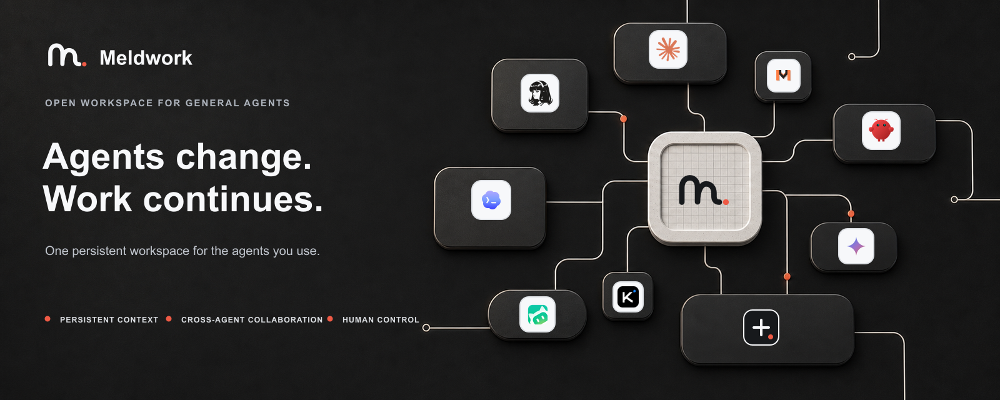
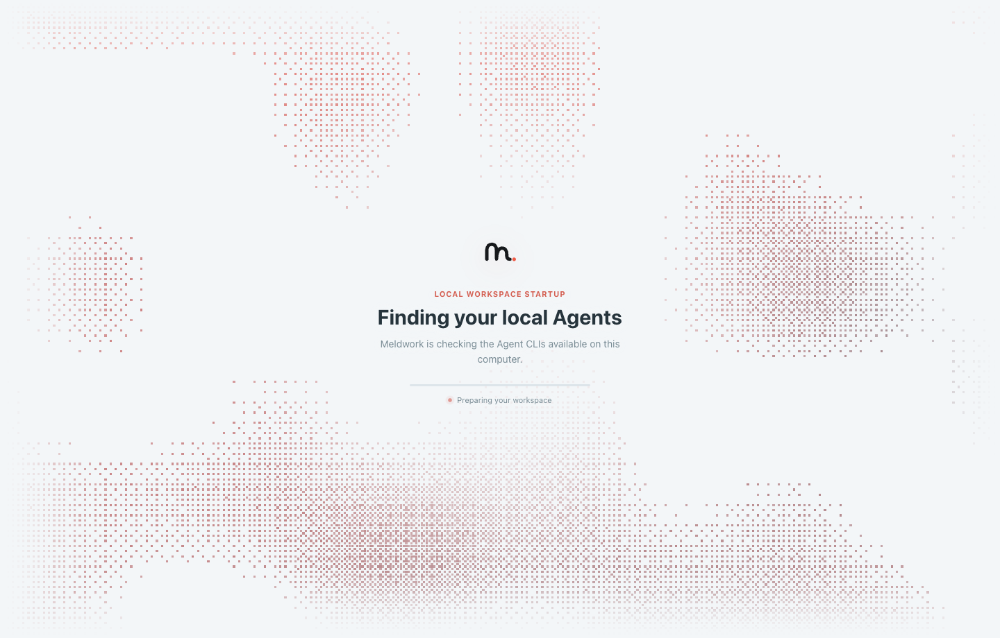
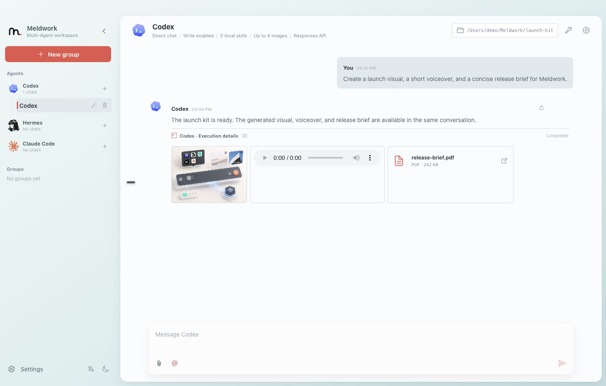
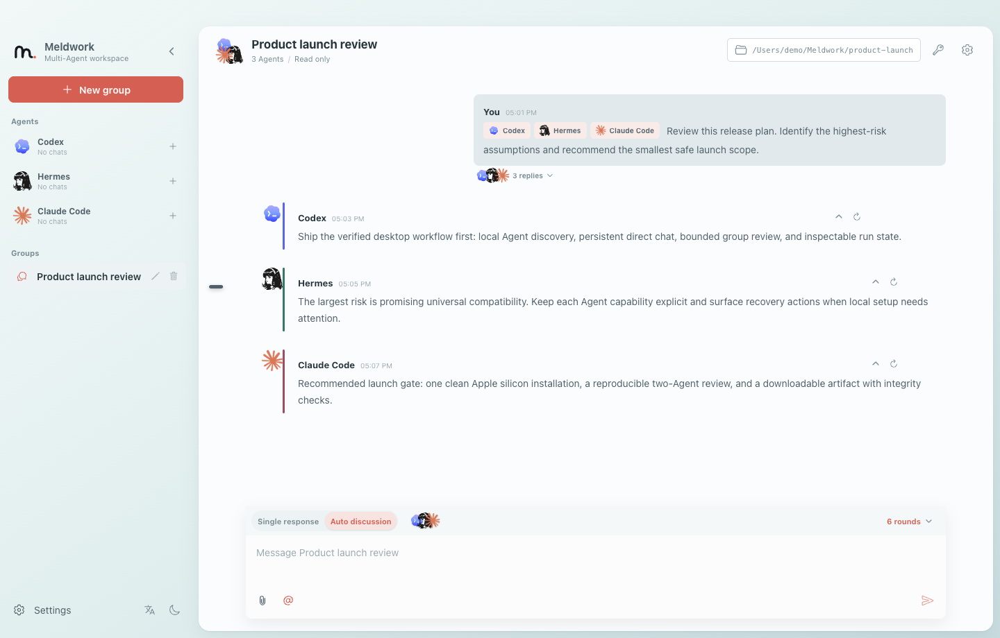

<div align="center">



[Architecture](architecture.md) · [Agent Connector Contract](docs/agent-connector-sdk.md) · [Contributing](CONTRIBUTING.md) · [Code of Conduct](CODE_OF_CONDUCT.md)

[English](README.md) | [简体中文](README.zh-CN.md)

[](LICENSE)
[](https://github.com/Ryder-MHumble/Meldwork/releases)

</div>

# Meldwork: Local-First Multi-Agent Collaboration Workspace

> Meldwork is a local-first Electron desktop workspace for multi-agent collaboration and agent orchestration. It brings supported local Agent CLIs into one AI agent workspace, runs concurrent or negotiated work, preserves inspectable evidence, and keeps a human in the loop before workspace writes and adoption decisions.

Meldwork is a source-available, local-first desktop application for people who already use more than one AI coding or research Agent. The current public preview is a single-user work cell: you choose the participants, the working directory, the context, and the final decision. There is no required Meldwork server, account, or remote conversation store.

<p align="center">
  <a href="https://github.com/Ryder-MHumble/Meldwork/releases/tag/Meldwork-V1.0.3"><strong>Download the V1.0.3 prerelease for Apple silicon macOS</strong></a>
  · <a href="architecture.md">Architecture</a>
  · <a href="desktop/README.md">Desktop guide</a>
  · <a href="LICENSE">License</a>
</p>

## What problem does it solve?

Using several Agents usually means manually choosing a tool, moving context between terminals, reconciling conflicting answers, and remembering why a change was accepted. Meldwork provides the organization layer between individual Agents and a finished decision:

- one shared goal and explicit acceptance boundary;
- independent proposals instead of hidden routing;
- declared permissions, responsibilities, handoffs, dependencies, and stopping conditions;
- durable, bounded artifacts and evidence that remain reviewable when Agents change;
- human-controlled permission, budget, write, and adoption decisions.

## Core capabilities

### Multi-agent collaboration and orchestration

- **Direct conversations and persistent groups**: keep Agent sessions, messages, working directories, Skills, knowledge references, images, and other attachments together in a local workspace.
- **Concurrent Responses**: freeze one task snapshot for all selected Agents, collect independent replies, and commit completed responses in stable member order.
- **Auto Discussion V4**: selected Agents produce independent proposals, challenge and negotiate a shared responsibility graph, execute dependency-aware work packages, converge through a single synthesis writer, and run independent verification.
- **Harness control plane**: enforce context, permission, budget, recovery, phase, receipt, and commit boundaries without privately assigning responsibilities outside the negotiated plan.
- **Evidence and traceability**: persist sanitized run traces and compact typed records for Artifacts, Evidence, Findings, and Adoption. Raw chain-of-thought, credentials, executable paths, and unrestricted tool output stay outside the renderer.
- **Human-in-the-loop safety**: workspace writes are opt-in. Permission, budget, ambiguous writable outcomes, and review decisions can require an explicit Human Gate; human adoption is recorded separately as an outcome.
- **Local-first context**: import validated local files and media, select bounded knowledge-source references, use target-scoped Skills, and configure compatible Providers without moving Meldwork conversations to a hosted service.

### Supported local Agent CLIs

Meldwork can detect and invoke these built-in local CLI profiles when the corresponding command is installed and compatible:

| Agent | Local command |
| --- | --- |
| Codex | `codex` |
| Hermes | `hermes` |
| OpenClaw | `openclaw` |
| WorkBuddy | `codebuddy` |
| Pi Agent | `pi`, `pi-agent`, or `piagent` |
| Kimi Code | `kimi` |
| MiMo Code | `mimo` |
| Claude Code | `claude` |
| Gemini CLI | `gemini` |
| OpenCode | `opencode` |
| Qwen Code | `qwen` |
| OpenCodeReview | `ocr` |

Custom Agents and the local Agent Connector SDK provide explicit extension paths. Connector packages are content-addressed, approved by the user, and constrained by declared capabilities; see the [Agent Connector SDK](docs/agent-connector-sdk.md).

## When Meldwork fits

| Use Meldwork when you need | Use the native tool or another product when you need |
| --- | --- |
| independent viewpoints from several local Agents on one goal | one Agent and one work surface are enough |
| concurrent responses or multi-round proposal, negotiation, work, and verification | a hosted team workspace or remote Agent fleet |
| inspectable evidence, bounded run traces, and explicit acceptance | automatic participant selection from a large roster |
| local files, Skills, knowledge references, and opt-in workspace writes | enterprise SSO, centralized governance, or organization-wide audit today |

Remote Agents, Cloud and Channel Connectors, automatic participant selection, enterprise governance, and an Outcome Network are outside the current public preview boundary. License terms follow the [Apache License 2.0](LICENSE); see [Commercial use](COMMERCIAL_USE.md) for a practical summary.

## Workflow

1. **Discover and select** the local Agent CLIs you want to use.
2. **Define context** with a working directory, prompt, validated files or media, Skills, and optional knowledge references.
3. **Choose a mode**: direct conversation, Concurrent Responses, or Auto Discussion V4.
4. **Review the trace**: inspect phase progress, Agent results, artifacts, evidence, and any Human Gate.
5. **Decide what to adopt**. Meldwork does not silently write to the workspace or make the final decision for you.

## Demo

| Local Agent discovery | Direct multimodal work | Concurrent multi-Agent work |
| --- | --- | --- |
| [](assets/meldwork-agent-discovery.png) | [](assets/meldwork-direct-multimodal.png) | [](assets/meldwork-group-collaboration.png) |
| Check which supported Agents are ready. | Keep prompts, files, permissions, and compatible sessions together. | Run concurrent replies or an Agent-negotiated collaboration with the participants you selected. |

## How it differs from adjacent tools

| Category | Typical focus | Meldwork's scope |
| --- | --- | --- |
| One Agent CLI or AI IDE | Deep work inside one Agent ecosystem | Preserve context and decisions across heterogeneous local Agents |
| Parallel coding-Agent manager | Throughput and isolated code tasks | Proposal quality, responsibility, evidence, and acceptance |
| Cloud Agent control plane | Remote jobs, sandboxes, and Agent fleets | Local-first execution with the Agents already installed on your computer |
| Programmable Agent framework | Developer-defined graphs, roles, and routing | A user-facing organization and review workflow around selected Agents |
| Terminals and scripts | Direct access to native Agent capabilities | Durable context, boundaries, traces, and explicit human decisions |

## Install

### Packaged preview: Apple silicon macOS

The current release-validated target is Apple silicon macOS.

1. Open the [Meldwork V1.0.3 prerelease](https://github.com/Ryder-MHumble/Meldwork/releases/tag/Meldwork-V1.0.3).
2. Download `Meldwork-0.1.3-arm64.dmg`.
3. Drag Meldwork into Applications and open it once.
4. This prerelease is ad-hoc signed, not signed with an Apple Developer ID, and not Apple-notarized. If macOS blocks it, open **System Settings -> Privacy & Security**, find the Meldwork warning, choose **Open Anyway**, and confirm.
5. Install or connect at least one supported local Agent CLI, then let Meldwork detect it.

Use only artifacts downloaded from the official GitHub Release.

### Run from source

Prerequisites: Node.js `22.12` or newer and npm.

```bash
npm --prefix frontend ci
npm --prefix desktop ci
npm --prefix desktop run dev
```

Run the repository checks before distributing a build:

```bash
npm --prefix frontend test
npm --prefix frontend run build
npm --prefix frontend run build:desktop
npm --prefix desktop test
```

For desktop-specific development, packaging, supported CLI details, and the provider matrix, see the [desktop guide](desktop/README.md).

## Trust boundaries and local data

- Conversations, groups, orchestration state, bounded run records, and imported attachment metadata stay in local Electron user data.
- Agent execution, file access, attachment validation, Provider storage, Connector approval, and installer control remain in the Electron main process behind narrow preload APIs.
- Provider API keys use operating-system-backed secure storage where supported; credentials and executable paths are not exposed to the renderer.
- Workspace writes are explicit and opt-in. Agent CLIs and their configured model Providers remain external dependencies with their own data-handling terms.
- Local-first does not mean every model runs offline: a selected Agent may still send prompts, attachments, or Skills to its configured Provider.

Read the [architecture](architecture.md) and [security policy](SECURITY.md) for the complete boundary and known limitations.

## Documentation and contribution

- [Architecture and product boundary](architecture.md)
- [Desktop setup, Agent matrix, and packaging](desktop/README.md)
- [Agent Connector SDK](docs/agent-connector-sdk.md)
- [AI discoverability index](docs/ai-discoverability.md)
- [Contributing](CONTRIBUTING.md)
- [Security policy](SECURITY.md)
- [Changelog](CHANGELOG.md)

## License

Meldwork is licensed under the [Apache License 2.0](LICENSE). You may use, modify, and redistribute the repository under its terms; third-party Agent products, models, dependencies, and brand assets remain subject to their own licenses and notices.
