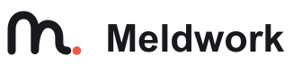

<!-- 

  <picture>
    <source media="(prefers-color-scheme: dark)" srcset="frontend/public/logos/meldwork-wordmark-v3-dark.svg">
    <source media="(prefers-color-scheme: light)" srcset="frontend/public/logos/meldwork-wordmark-v3.svg">
    
  </picture>

 -->

  

  <strong>English</strong> · <a href="README.zh-CN.md">简体中文</a>

# Meldwork builds the organization layer for AI agents.

**Most tools help humans run more agents. Meldwork is built for a different job: make multi-agent work legible, accountable, and reusable.**

The current preview is a local work cell for supported Agent CLIs. It keeps participants explicit, context scoped, collaboration bounded, run state inspectable, and human review in the loop. Selected Agents can now respond concurrently or move through independent proposals, peer negotiation, responsibility-based work, single-writer integration, and independent verification around one goal.

  <a href="https://github.com/Ryder-MHumble/Meldwork/releases/download/Meldwork-V1.0.3/Meldwork-0.1.3-arm64.dmg"><strong>Download Meldwork V1.0.3 for Apple silicon macOS</strong></a>
  · <a href="architecture.md">Architecture</a>
  · <a href="LICENSE">License</a>

## The missing layer in the Agent workforce

Agent supply is growing quickly. The organization around it is not.

Today, people still choose every Agent, move every piece of context, explain every role, reconcile conflicting answers, and carry the final accountability. Parallel managers improve throughput. Agent frameworks let developers program workflows. Single-Agent products improve one worker.

Meldwork is focused on the work between them:

- one shared goal and acceptance boundary;
- independent viewpoints instead of hidden routing;
- explicit authority, responsibility, handoffs, and stopping conditions;
- artifacts and evidence that survive Agent changes;
- a human-controlled adoption decision.

## What Meldwork is building

The collaboration mechanism is not a hidden preset A → B → C assignment. The user selects the participants; those Agents expose the solution space, negotiate responsibilities, and execute inside Harness-enforced context, permission, budget, recovery, and evidence boundaries.

The selected-Agent proposal, challenge, responsibility, work, integration, and verification loop is available today. Automatic participant selection from a broader roster, remote Agents, enterprise governance, and outcome-driven reputation remain future direction.

### Demo

| Local Agent discovery | Direct multimodal work | Concurrent multi-Agent work |
| --- | --- | --- |
|  |  |  |
| See which supported Agents are ready. | Keep prompts, files, permissions, and compatible sessions together. | Run concurrent replies or an Agent-negotiated collaboration with the participants you selected. |

## What makes Meldwork different

### Harness design

The Harness is the control plane that keeps conversations, context, adapters, streams, and durable state aligned in one workspace. It is what makes a run continuous across sessions, timeouts, recovery, and Agent changes.

  

This is a comparison of working models, not a feature-scorecard claiming Meldwork should replace every tool.

| Approach | Examples | Best at | Main tradeoff | Meldwork's choice |
| --- | --- | --- | --- | --- |
| One Agent CLI or AI IDE | Claude Code, Codex, Cursor, Windsurf | Deep work inside one Agent or product ecosystem | Moving to another Agent still requires a manual handoff | Preserve work across heterogeneous Agents |
| Parallel coding-Agent managers | Superset, Vibe Kanban, Nimbalyst, Conductor | Running multiple coding tasks and isolated workspaces in parallel | Primarily optimized for throughput and code delivery | Optimize proposal quality, responsibility, evidence, and adoption |
| Cloud Agent control planes | GitHub Agent HQ, Warp Oz, Devin, Factory, OpenHands Cloud | Dispatching and observing remote jobs, sandboxes, and Agent fleets | Work is organized around cloud or platform infrastructure | Start local-first and bring your existing Agents |
| Programmable Agent frameworks | LangGraph, CrewAI, AutoGen, Agents SDK, ADK | Building custom graphs, roles, routing, and automation | Developers must design and maintain the orchestration | Deliver an organization and acceptance experience to users |
| Multiple terminals and scripts | tmux, shell scripts, manual copy and paste | Maximum access to native Agent capabilities | The user becomes the router, context bus, and final judge | Make the work, boundaries, and decisions durable |
| **Meldwork** | Supported local Agent CLIs; remote supply is direction | Concurrent independent responses and selected-Agent proposal, negotiation, responsibility, evidence, and verification | Local single-user preview today; participants are still selected by the user | Build the organization layer for the Agent workforce |

If one Agent and one work surface are enough, use the native tool. Use Meldwork when handoff, independent judgment, authority, evidence, and acceptance become part of the problem.

## Install

The current release-validated target is Apple silicon macOS.

1. Open the [Meldwork V1.0.3 prerelease](https://github.com/Ryder-MHumble/Meldwork/releases/tag/Meldwork-V1.0.3).
2. Download Meldwork-0.1.3-arm64.dmg.
3. Drag Meldwork into Applications and try to open it once.
4. This prerelease is ad-hoc signed, not signed with an Apple Developer ID, and not Apple-notarized. If macOS blocks it, open **System Settings → Privacy & Security**, find the Meldwork warning, choose **Open Anyway**, and confirm.
5. Connect a supported Agent CLI already installed on the computer, or configure an independent Provider profile where supported.

Use only artifacts downloaded from the official Release.

<strong>Build from source</strong>

Requires Node.js 22.12 or newer and npm.

~~~bash
npm --prefix frontend ci
npm --prefix desktop ci
npm --prefix desktop run dev
~~~

Run the repository checks before distributing a build:

~~~bash
npm --prefix frontend test
npm --prefix frontend run build
npm --prefix frontend run build:desktop
npm --prefix desktop test
~~~

## Trust boundaries

- Conversations and Meldwork orchestration state stay local.
- Model requests still follow the Agent and Provider you choose; local-first does not mean every model runs offline.
- Credentials use operating-system-backed secure storage where supported.
- Workspace writes are explicit and opt-in.
- Raw chain-of-thought, executable paths, secrets, and unrestricted command output are not exposed to the renderer.
- Cloud, Channel, automatic participant selection, enterprise governance, and an Outcome Network are not current release promises.

Read the [architecture](architecture.md) and [Agent Connector contract](docs/agent-connector-sdk.md) for the public technical boundary.

## License

Meldwork is source-available under the [Meldwork Non-Commercial Source License](LICENSE). You may inspect, run, modify, and share it for non-commercial purposes. Commercial use requires prior written permission; see [COMMERCIAL_USE.md](COMMERCIAL_USE.md).
