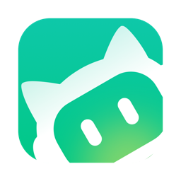
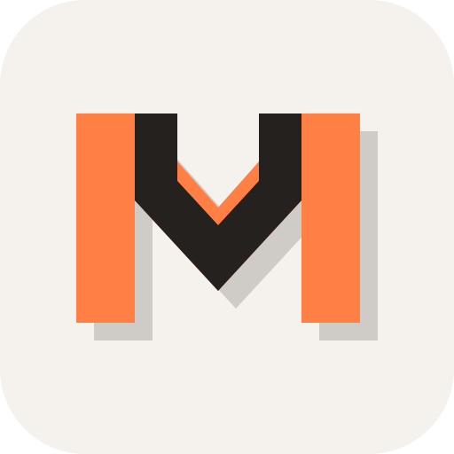
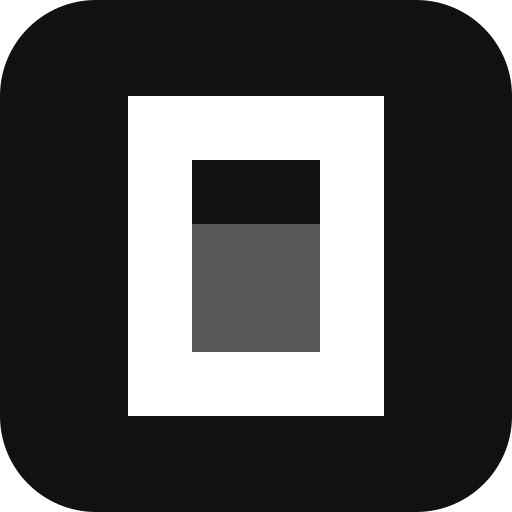
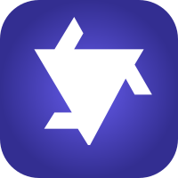

<p align="center">
  
</p>

<p align="center">
  <strong>English</strong> · <a href="README.zh-CN.md">简体中文</a>
</p>

# Meldwork - Local-first Multi-Agent Collaboration Workspace

> Coordinate local Agent CLIs, compare independent work, and review evidence before anything is written.

Meldwork is a source-available Electron desktop app and local-first multi-agent collaboration workspace for developers, researchers, and technical teams who use more than one AI Agent. It brings local Agent CLIs such as Codex, Claude Code, Gemini CLI, OpenCode, and Qwen Code into one place for direct chats, concurrent responses, evidence-aware runs, and human-in-the-loop Agent orchestration.

The current public preview is a single-user Apple-silicon macOS work cell. You choose the participants, working directory, context, permissions, and final adoption decision. No Meldwork account, server, or hosted conversation store is required.

<p align="center">
  <a href="https://github.com/Ryder-MHumble/Meldwork/releases/download/Meldwork-V1.0.3/Meldwork-0.1.3-arm64.dmg"><strong>Download the Apple silicon macOS preview</strong></a>
  · <a href="https://github.com/Ryder-MHumble/Meldwork/releases/tag/Meldwork-V1.0.3">Release notes</a>
  · <a href="architecture.md">Architecture</a>
  · <a href="desktop/README.md">Desktop guide</a>
  · <a href="LICENSE">License</a>
</p>

## Who it is for

Use Meldwork when you:

- already have multiple local Agent CLIs and need one task to span them;
- need independent review for code, research, or product analysis before choosing a path;
- need inspectable traces, evidence, and human review before workspace writes.

## Workflow

1. **Select** the local Agents and participants.
2. **Scope** the goal, working directory, context, and permissions.
3. **Run** Direct, Concurrent Responses, or Auto Discussion V4.
4. **Review and adopt** the result, evidence, and any Human Gate before changing the workspace.

## Collaboration modes

| Mode | What happens | Best for |
| --- | --- | --- |
| **Direct** | One selected Agent keeps its conversation and native session when supported. | Focused work with one Agent. |
| **Concurrent Responses** | Selected Agents receive the same frozen task snapshot and return independent replies in stable order. | Comparing approaches before choosing one. |
| **Auto Discussion V4** | Selected Agents propose, challenge, negotiate responsibilities, execute dependency-aware work, then verify the result. | Multi-round work that needs explicit responsibility and review. |

Participants are always selected by the user. Automatic selection from a larger roster is outside the current preview.

## How Meldwork differs

Meldwork is a local-first AI Agent workspace for multi-Agent review and decision traceability, not a terminal, cloud Agent fleet, communication network, or programmable orchestration framework. It connects the local Agent tools you already use to a decision-ready review workflow and keeps independent findings, evidence, responsibility, and the human adoption decision visible in one local work cell.

| Project | Category | What it focuses on | Meldwork's difference |
| --- | --- | --- | --- |
| [Buzz](https://github.com/block/buzz) | Agent communication network | Identity, channels, events, and persistent collaboration. | Case-scoped independent judgments with evidence-backed Decision and Disposition. |
| [Pragma](https://github.com/pqpo/pragma) | Method and workflow runtime | Reusable Expert, Flow, Memory, Evaluation, and DSL assets. | Keeps disagreement, re-checks, and adoption records visible before a workflow is fixed. |
| [Munder Difflin](https://github.com/chaitanyagiri/munder-difflin) | Visual Agent company | Boss -> Manager -> Workers, with task and activity status. | Tracks Finding -> Evidence -> Decision -> Disposition without hiding dissent behind a central manager. |
| [Superset](https://github.com/superset-sh/superset) / [Conductor](https://www.conductor.build/) / [Vibe Kanban](https://github.com/BloopAI/vibe-kanban) | Parallel coding workspaces | Parallel coding Agents, isolated workspaces, diffs, and merges. | Local-first review across heterogeneous CLIs, not terminal count, worktree throughput, or cloud sandboxes. |
| [cmux](https://github.com/manaflow-ai/cmux) | Agent-native terminal | Low-friction terminals, notifications, and multitasking. | Adds frozen context, independent results, and a human adoption gate. |
| [Nimbalyst](https://github.com/nimbalyst/nimbalyst) | Agent and artifact workspace | Parallel Agents with Markdown, mockups, and diagrams. | Places evidence and accountable decisions alongside artifacts. |
| [Paperclip](https://github.com/paperclipai/paperclip) | Agent organization management | Companies, roles, budgets, approvals, and org charts. | Grounds responsibility in real findings and outcomes, not a virtual company. |
| [MCP Agent Mail](https://github.com/Dicklesworthstone/mcp_agent_mail) | Agent communication infrastructure | Identity, inboxes, threads, and advisory file leases. | Preserves Case and review semantics above the transport layer. |
| LangGraph / CrewAI / AutoGen / OpenAI Agents SDK / Google ADK | Programmable multi-Agent frameworks | Graphs, roles, routing, tools, and approvals for developers. | Delivers a desktop review workflow without requiring teams to build an orchestration framework. |
| Warp Oz / Devin / Factory / OpenHands Cloud | Cloud Agent control planes | Hosted sandboxes, remote execution, and Agent fleets. | Runs in the user's local Electron work cell with existing CLIs and local data boundaries. |

## See it in action

<table>
  <tr>
    <th>Local Agent discovery</th>
    <th>Multi-agent review</th>
    <th>Direct multimodal work</th>
  </tr>
  <tr>
    <td align="center"><a href="assets/meldwork-agent-discovery.png"></a></td>
    <td align="center"><a href="assets/meldwork-multi-agent-review.png"></a></td>
    <td align="center"><a href="assets/meldwork-direct-multimodal.png"></a></td>
  </tr>
</table>

Example: give Codex, Claude Code, and Gemini CLI the same change-review context, compare their independent findings, then adopt only the evidence-backed result you approve.

## Supported local Agent CLIs

Meldwork detects and invokes an installed command when its adapter and the CLI version are compatible:

<table>
  <tr>
    <td align="center" valign="top"><br><strong>Codex</strong><br><code>codex</code></td>
    <td align="center" valign="top"><br><strong>Hermes</strong><br><code>hermes</code></td>
    <td align="center" valign="top"><br><strong>OpenClaw</strong><br><code>openclaw</code></td>
  </tr>
  <tr>
    <td align="center" valign="top"><br><strong>WorkBuddy</strong><br><code>codebuddy</code></td>
    <td align="center" valign="top"><br><strong>Pi Agent</strong><br><code>pi</code> · <code>pi-agent</code> · <code>piagent</code></td>
    <td align="center" valign="top"><br><strong>Kimi Code</strong><br><code>kimi</code></td>
  </tr>
  <tr>
    <td align="center" valign="top"><br><strong>MiMo Code</strong><br><code>mimo</code></td>
    <td align="center" valign="top"><br><strong>Claude Code</strong><br><code>claude</code></td>
    <td align="center" valign="top"><br><strong>Gemini CLI</strong><br><code>gemini</code></td>
  </tr>
  <tr>
    <td align="center" valign="top"><br><strong>OpenCode</strong><br><code>opencode</code></td>
    <td align="center" valign="top"><br><strong>Qwen Code</strong><br><code>qwen</code></td>
    <td align="center" valign="top"><br><strong>OpenCodeReview</strong><br><code>ocr</code></td>
  </tr>
</table>

Approved Agent Connectors can be added through the [Agent Connector SDK](docs/agent-connector-sdk.md); custom executable Agents use the desktop custom-Agent path. See the [desktop guide](desktop/README.md) for the full adapter and capability matrix.

## Quick start

### Apple silicon macOS preview

Download [`Meldwork-0.1.3-arm64.dmg`](https://github.com/Ryder-MHumble/Meldwork/releases/download/Meldwork-V1.0.3/Meldwork-0.1.3-arm64.dmg) from the [official V1.0.3 prerelease](https://github.com/Ryder-MHumble/Meldwork/releases/tag/Meldwork-V1.0.3), move Meldwork to Applications, and install at least one supported local Agent CLI. The prerelease is ad-hoc signed and not notarized; macOS may require **Open Anyway** in **System Settings -> Privacy & Security** on first launch.

### Run from source

Prerequisites: Node.js `22.12+` and npm.

```bash
npm --prefix frontend ci
npm --prefix desktop ci
npm --prefix desktop run dev
```

Before distributing a build:

```bash
npm --prefix frontend test
npm --prefix frontend run build
npm --prefix frontend run build:desktop
npm --prefix desktop test
```

## Current boundary

Meldwork is a local Electron app, not a hosted Agent fleet or a general Agent framework. The current preview does not provide remote/cloud/channel Agent execution, automatic participant selection, enterprise SSO/RBAC/governance, or an Outcome Network. Local-first does not mean fully offline: a selected Agent may send prompts, attachments, or Skills to its configured Provider. Workspace writes are opt-in workflow controls, not an operating-system sandbox.

## Docs

- [Architecture and product boundary](architecture.md)
- [Desktop setup and Agent matrix](desktop/README.md)
- [Agent Connector SDK](docs/agent-connector-sdk.md)
- [AI discoverability index](docs/ai-discoverability.md)
- [Contributing](CONTRIBUTING.md)
- [Security policy](SECURITY.md)

## License

Meldwork is licensed under the [Apache License 2.0](LICENSE). You may use, modify, and redistribute the repository under its terms; third-party Agent products, models, dependencies, and brand assets remain subject to their own licenses and notices.
