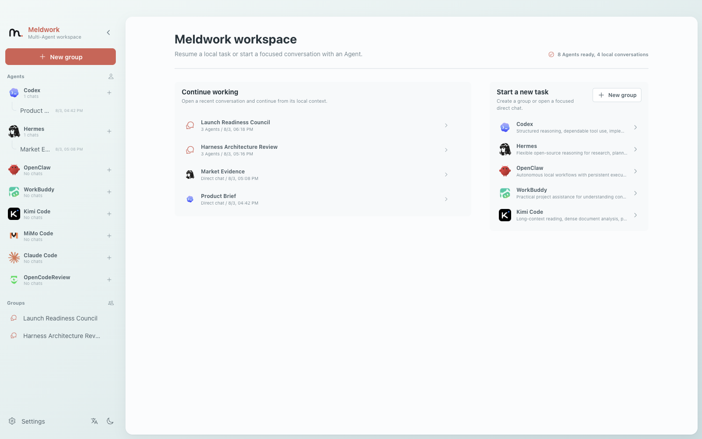

<p align="center">
  
</p>

<p align="center">
  <strong>English</strong> · <a href="README.zh-CN.md">简体中文</a>
</p>

# AI agents are interchangeable. Your work should not be.

**Meldwork is a local-first desktop workspace where one task can move between direct Agent conversations, multi-Agent working groups, and independent review without losing its context or execution history.**

Start with one Agent. Bring in others when the work needs a different capability, a second opinion, or an adversarial review. Meldwork keeps the conversation, participants, permissions, outputs, and sanitized run evidence together on your computer.

<p align="center">
  <a href="https://github.com/Ryder-MHumble/Meldwork/releases/latest"><strong>Download the private macOS preview</strong></a>
  · <a href="LICENSE">Noncommercial license</a>
  · <a href="COMMERCIAL_USE.md">Commercial use</a>
</p>

## Install the desktop client

The current private preview is built for Apple silicon Macs.

1. Open the [latest GitHub Release](https://github.com/Ryder-MHumble/Meldwork/releases/latest).
2. Download `Meldwork-0.1.0-arm64.dmg`.
3. Drag Meldwork into Applications and open it.
4. Connect the supported Agent CLIs already installed on your computer, or configure an independent Provider profile for an Agent.

The private preview is ad-hoc signed and not yet Apple-notarized. A public distribution build will require Developer ID signing and notarization.

## One place to see the work



Direct conversations and working groups live in the same desktop workspace. A task can begin as a focused conversation and become a group review without turning into a trail of disconnected windows.

## From a first answer to a reviewed decision

| Step | What happens in Meldwork |
| --- | --- |
| Start | Open a direct conversation with the Agent best suited to the first step |
| Escalate | Create a working group and select only the Agents that should participate |
| Discuss | Run a manual handoff or a bounded automatic multi-round discussion |
| Verify | Inspect final replies, status, source context, and sanitized execution traces before accepting the result |


The conversation remains readable while Agent-specific process details stay available on demand. Group runs preserve compact evidence for later Agents and for the human making the final decision.

## Why teams use Meldwork

- **Research:** one Agent builds the evidence base while another challenges unsupported assumptions.
- **Product and strategy:** one develops the proposal, another tests positioning, feasibility, and expensive failure modes.
- **Software delivery:** one implements, another reviews the diff and the reasoning behind it.
- **Writing and content:** one creates, another checks structure, factual accuracy, and tone.
- **Operations:** specialized Agents handle different parts of the task while the full work record stays visible.

The goal is not to maximize Agent count. It is to use the right Agent at the right moment without fragmenting the work.

## What the desktop client keeps together

- Persistent direct conversations and multi-Agent working groups.
- Explicit Agent targeting, manual runs, and automatic multi-round discussions.
- Compatible native-session continuity for each conversation and Agent.
- Sanitized run traces, completion state, and compact evidence capsules.
- Agent-specific Provider profiles and operating-system-backed credential storage where supported.
- Skills, images, approved knowledge sources, and opt-in workspace access.
- Local conversation and orchestration state with no Meldwork cloud account or remote conversation store.

Model requests still follow the Agent and Provider you choose. Local-first describes Meldwork's workspace and orchestration state; it does not make third-party models offline.

## Connected Agents

Meldwork currently integrates with:

**Codex · Hermes · OpenClaw · WorkBuddy · Kimi Code · MiMo Code · Claude Code · Gemini CLI · OpenCode · Qwen Code · OpenCodeReview · Custom Agents**

Each Agent keeps its own capabilities, provider configuration, permission model, and session behavior. Availability depends on the installed Agent, its version, and its authentication state.

## Private MVP status

This repository and its Releases are currently private while the MVP is being completed. The macOS Apple silicon client is the only release-validated target in this preview. Windows, Intel Mac, Apple notarization, and broad third-party Agent certification are not yet claimed.

<details>
<summary><strong>Build from source for development</strong></summary>

Requires Node.js 20.19 or newer and npm.

```bash
npm --prefix frontend ci
npm --prefix desktop ci
npm --prefix desktop run dev
```

Verification commands are documented in [docs/tests.md](docs/tests.md).

</details>

## License

Meldwork is source-available under the [PolyForm Noncommercial License 1.0.0](LICENSE). It is not Apache-2.0 licensed: Apache 2.0 permits commercial use, while this project currently does not.

Noncommercial use is permitted only under the license terms. Commercial use requires a separate written agreement; see [COMMERCIAL_USE.md](COMMERCIAL_USE.md). Third-party attribution is recorded in [NOTICE](NOTICE).
