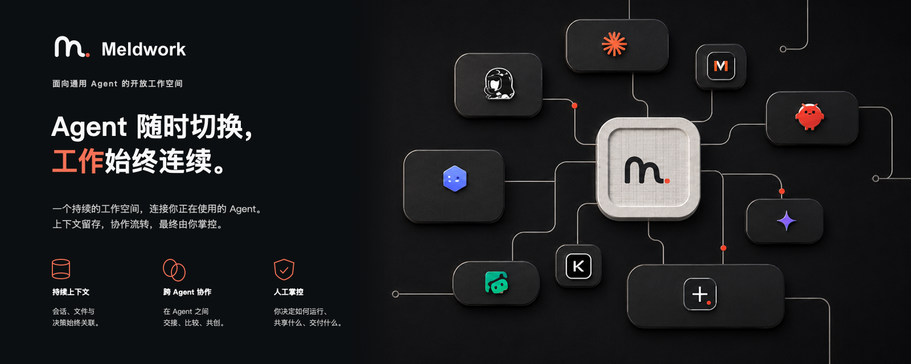

<p align="center">
  
</p>

<p align="center">
  <a href="README.md">English</a> · <strong>简体中文</strong>
</p>

# 一项任务，不同 Agent，一份可检查的结果

**Meldwork 是一个本地优先的 Agent 桌面工作空间。当工作在不同通用 Agent 之间流转时，它把会话、文件、权限、兼容的原生 Session 与脱敏运行证据留在同一个地方。**

多数 Agent 已经能够完成一段工作。真正脆弱的是切换工具之后：上下文需要手工复制，文件要重新附加，权限边界容易丢失，最终答案看起来完整，却很难说明它是如何形成的。

Meldwork 让任务保持稳定，让 Agent 按需变化。先从一个 Agent 开始；只有当任务需要另一种能力或独立质疑时，再加入第二个 Agent；最后由你检查结果并决定保留什么。

<p align="center">
  <a href="docs/harness-engine-strategy.md"><strong>了解 Harness</strong></a>
  · <a href="#从源码运行">从源码运行</a>
  · <a href="LICENSE">AGPL-3.0 开源许可证</a>
</p>

## 问题不在 Agent 数量，而在工作被切碎

| 当工作跨越多个 Agent 工具 | Meldwork 保留下来的内容 |
| --- | --- |
| 会话历史散落在不同应用 | 持续存在的单聊或工作群组 |
| 文件和要求反复复制 | 明确的任务文件、Skill、知识来源与有界上下文 |
| 权限范围容易丢失 | 可见的工作目录与按需开启的写入权限 |
| 多个答案带来更多噪音 | 限定轮次、Agent 独立结果与人工决定 |
| 最终输出难以复盘 | 脱敏事件、上下文来源、状态与精简证据 |

Meldwork 不会自动合并彼此无关的会话历史。哪些消息、文件、Skill 和知识来源进入任务，始终由你决定。

## 一条可以重复使用的工作流

1. **先聚焦。** 选择最适合第一步的 Agent，打开单聊开始工作。
2. **只加入必要上下文。** 附加任务文件，选择兼容的 Skill 或已经配置的知识来源；除非任务必须修改文件，否则保持工作目录只读。
3. **引入第二种视角。** 创建群组，只选择真正需要参与的 Agent，再使用手动接力或限定轮次的自动讨论。
4. **检查后再接受。** 查看每个 Agent、每一轮、结论、注入的上下文来源和脱敏事件，再决定采用、修改还是放弃结果。

## 单聊与协作共享一个工作空间


单聊和工作群组位于同一个桌面工作空间。左侧栏反映这台电脑上可以使用的 Agent；主工作区把当前任务、工作目录、权限和最近会话放在随时可回到的位置。

## 工作空间背后的 Harness


单聊的运行进度直接显示在对话中；群组 Run 会额外提供按 Agent 和轮次查看的运行详情。两种界面背后，Harness 负责统一 Agent 事件、构建有界 Context Pack、隔离兼容的原生 Session、保存本地 Run 状态，并把恢复过程变成明确状态。

- **运行控制：** 明确点名、手动接力、限定轮次的自动讨论、停止与单 Agent 控制。
- **上下文控制：** 稳定约束、选定文件、按目标分配的 Skill 与知识来源、近期结论和精简证据摘要。
- **可检查的执行过程：** 结论、上下文来源、警告、终态，以及所选 Agent 或传输能够提供的计划和工具生命周期摘要，同时不暴露原始思维链或凭据。
- **持久本地状态：** 会话与有界 Run 记录在完成或中断后仍可查看；Context Pack 保持持久并可追溯。
- **明确恢复：** 认证与兼容性错误需要先修正配置，再由用户重试，不进行无条件反复尝试。

中断的多 Agent 工作会留下记录，但目前并非所有工作流都能从上一个 Agent 执行位置精确续跑。当前行为优先保留可检查的中断状态，避免静默重复工作或外部副作用。

## 当前可以完成什么

- 保留持续存在的 Agent 单聊与多 Agent 工作群组。
- 明确点名一个或多个 Agent，或为自动讨论设置最大轮数。
- 附加经过验证的图片、音视频、文档、代码和压缩包，具体取决于所选 Agent 的能力。
- 为对应 Agent 目标加入最多四个兼容 Skill，以及已配置的飞书、钉钉或 Obsidian 知识来源。
- 在兼容条件下延续原生 Session，同时不向渲染层暴露 Session 标识。
- 默认关闭工作目录写入权限，并在任务确实需要修改文件时按会话开启。
- 在单聊中查看脱敏运行详情，在群组中按 Agent 和轮次检查执行状态。
- 在兼容系统上使用操作系统安全存储保存 Agent 专属 Provider 配置。

## 它适合哪些工作

- **研究与情报：** 一个 Agent 建立证据基础，另一个寻找证据缺口与错误假设。
- **产品与战略：** 一个完善方案，另一个检查用户价值、可行性和高成本风险。
- **软件交付：** 一个负责实现，另一个审查代码改动、测试和关键判断。
- **写作与运营：** 一个形成交付物，另一个检查准确性、结构和执行风险。

目标不是让更多 Agent 同时发言，而是用最小且有价值的组合完成任务，同时不丢失边界、上下文和证据。

## 当前连接的 Agent

通用 Agent：

**Codex · Hermes · OpenClaw · WorkBuddy · Kimi Code · MiMo Code · Claude Code · Gemini CLI · OpenCode · Qwen Code**

专项审查：

**OpenCodeReview**

能否实际使用取决于本机安装情况、受支持版本、认证状态和 Agent 声明的能力。OpenCodeReview 是专项审查目标，不作为通用对话 Agent 使用。

## 数据与控制边界

Meldwork 的工作空间与编排记录保存在本机，不要求 Meldwork 云账号或远程会话数据库。模型和工具请求仍会按照你配置的 Agent 与 Provider 发出。

工作目录写入是按会话明确开启的权限，但 Meldwork 不是操作系统级沙箱。Agent 进程仍以本地用户身份运行，上游工具需要对其声明的能力负责。

## 从源码运行

需要 Node.js 20.19 或更高版本以及 npm。

```bash
npm --prefix frontend ci
npm --prefix desktop ci
npm --prefix desktop run dev
```

目前最充分的打包与运行验证集中在 Apple 芯片 macOS。Windows 已具备实现层支持，但广泛的真实设备验证仍未完成。

完整验证命令与已知缺口见 [docs/tests.md](docs/tests.md)。

## 文档

- [Harness Engine 战略](docs/harness-engine-strategy.md)
- [架构](docs/architecture.md)
- [权限边界](docs/permissions.md)
- [测试与验证](docs/tests.md)

## 许可证

Meldwork 社区版采用 [GNU Affero General Public License v3.0 only](LICENSE) 开源。AGPL 允许个人和公司商用、修改与分发，但分发修改版本或通过网络向用户提供修改版本时，需要按照许可证提供对应源代码。

需要闭源分发、嵌入专有产品，或使用单独授权商业版的组织，可以申请商业许可证，详见 [COMMERCIAL_USE.md](COMMERCIAL_USE.md)。第三方标识归属见 [NOTICE](NOTICE)。
