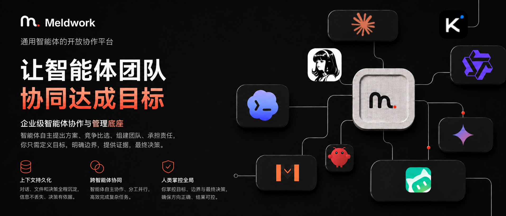

<!-- 

  <picture>
    <source media="(prefers-color-scheme: dark)" srcset="frontend/public/logos/meldwork-wordmark-v3-dark.svg">
    <source media="(prefers-color-scheme: light)" srcset="frontend/public/logos/meldwork-wordmark-v3.svg">
    
  </picture>

 -->

  

  <a href="README.md">English</a> · <strong>简体中文</strong>

# Meldwork 为 AI Agent 构建组织层

**多数工具是在帮人类管更多 Agent；Meldwork 解决的是另一件事：让多 Agent 协作变得可见、可追责、可复用。**

当前预览版是一个面向已支持本地 Agent CLI 的本地工作单元。它把参与者、上下文、协作边界、运行状态和人类复核放在同一个工作空间里。已选 Agent 现在可以并发回复，也可以围绕同一目标先独立提案、再协商职责、分工执行、单写者整合并由其他 Agent 独立复核。

  <a href="https://github.com/Ryder-MHumble/Meldwork/releases/download/Meldwork-V1.0.2/Meldwork-0.1.2-arm64.dmg"><strong>V1.0.2 预发布创建后下载 Apple 芯片 macOS 版</strong></a>
  · <a href="architecture.md">架构</a>
  · <a href="LICENSE">许可证</a>

## Agent workforce 缺少的那一层

Agent 的供给正在快速增长，但围绕它们工作的组织能力并没有跟上。

今天，人类仍然需要自己选 Agent、搬运上下文、解释角色、处理冲突答案，并承担最终责任。并行管理器优化吞吐量，多 Agent 框架让开发者编写 Workflow，单 Agent 产品优化一个 Worker。

Meldwork 关注的是中间那层工作：

- 一个共享 Goal 和明确验收边界；
- 独立判断，而不是隐藏路由；
- 明确的权限、责任、交接和停止条件；
- 不随 Agent 切换而丢失的 Artifact 与 Evidence；
- 由人类掌握的最终采用决定。

## 当前已经可用

- **支持的本地 Agent CLI**：检测、检查并受控调用已批准的 Agent，不把不受限的 Shell 暴露给 Renderer。
- **持续的直接工作**：把本地历史、附件、权限、兼容的原生 Session 和脱敏执行详情放在一起，尽量不让上下文断线。
- **并发回复**：一条消息同时发给多个已选 Agent，执行前冻结同一份任务上下文，并以稳定批次公布各自独立回复。
- **Agent 自主协商协作**：先独立提案，再互相质询并全员同意一份职责图，随后执行不同工作包，由唯一写入者整合，并由不同 Agent 独立复核。
- **可检查执行**：保留有界运行事件、警告、终态、检查点和恢复动作，不暴露凭据或私有推理。
- **本地控制**：Meldwork 的会话和编排状态都留在电脑上；工作目录写入必须主动开启。

具体能力仍取决于所选 Agent、本机版本、认证状态、Provider 和声明的工具/附件支持。

## Meldwork 正在构建什么

当前协作机制不是 Harness 暗中预设的 A → B → C 分配链。用户选定参与者后，Agent 先展开解空间、自主协商职责，再在 Harness 管理的上下文、权限、预算、恢复和证据边界内执行。

~~~mermaid
flowchart LR
  G["目标与验收契约"] --> P["独立竞案"]
  P --> C["公开质询"]
  C --> B["角色声明与团队竞案"]
  B --> R["责任契约"]
  R --> X["有界执行"]
  X --> E["产物与证据"]
  E --> H["人类采用"]
  H --> O["结果回执"]
  O -. "Agent Fit + Team Fit" .-> P
~~~

已选 Agent 的独立提案、交叉质询、职责协商、分工执行、整合和复核现在已经可用。从更大候选池自动选人组队、远程 Agent、企业治理和 Outcome 驱动的声誉系统仍是未来方向。

## Harness

Harness 是把会话、上下文、适配器、流和持久化状态拴在一起的控制平面。它让一次任务可以跨会话、超时、恢复和 Agent 切换继续下去。

  

## Meldwork 在哪里

这张表比较的是不同工作范式，不是一张声称 Meldwork 应当替代所有工具的功能勾选表。

| 范式 | 例子 | 最擅长什么 | 主要代价 | Meldwork 的选择 |
| --- | --- | --- | --- | --- |
| 单 Agent CLI / AI IDE | Claude Code、Codex、Cursor、Windsurf | 在一个 Agent 或产品生态内完成深度工作 | 换 Agent 时仍需手工交接 | 保留跨异构 Agent 的工作 |
| 并行 Coding-Agent 工作台 | Superset、Vibe Kanban、Nimbalyst、Conductor | 并行运行多个 Coding 任务和隔离工作区 | 主要优化吞吐量和代码交付 | 优化方案质量、责任、证据和采用 |
| Cloud Agent 控制面 | GitHub Agent HQ、Warp Oz、Devin、Factory、OpenHands Cloud | 派发和观察远程 Job、Sandbox 与 Agent Fleet | 工作围绕云基础设施和平台边界 | 先从 Local-first 和 BYO Agent 切入 |
| 可编程多 Agent 框架 | LangGraph、CrewAI、AutoGen、Agents SDK、ADK | 开发者自定义 Graph、角色、路由和自动化 | 需要开发者设计并维护编排 | 面向使用者交付组织与验收体验 |
| 多终端与脚本 | tmux、Shell、手工复制粘贴 | 最大化原生 Agent 访问权 | 人类成为 Router、Context Bus 和最终裁决者 | 让工作、边界和决定保持持续 |
| **Meldwork** | 已支持本地 Agent CLI；远程供给属于方向 | 并发独立回复，以及已选 Agent 之间的提案、协商、责任、Evidence 和复核 | 当前仍是本地单用户预览；参与者仍由用户选定 | 构建 Agent workforce 的组织层 |

如果一个 Agent 和一个工作面已经足够，直接使用原生工具。只有当交接、独立判断、权限、证据和验收成为问题时，才需要 Meldwork。

## 看看当前 Work Cell

| 本地 Agent 检测 | 单聊中的多模态工作 | 并发多 Agent 协作 |
| --- | --- | --- |
|  |  |  |
| 查看哪些受支持 Agent 已就绪。 | Prompt、文件、权限和兼容 Session 留在一起。 | 让已选 Agent 并发回复，或进入由 Agent 自主协商职责的协作流程。 |

## 当前可连接的 Agent

当前集成包括：

**Codex · Hermes · OpenClaw · WorkBuddy · Kimi Code · MiMo Code · Claude Code · Gemini CLI · OpenCode · Qwen Code**

专项审查：

**OpenCodeReview**

能否使用取决于安装、版本、认证、Provider 和声明的能力。每个 Agent 保留自己的工具、Session 行为和权限模型。

## 安装

当前经过发布验证的目标是 Apple 芯片 macOS。

1. 发布创建后，打开 [Meldwork V1.0.2 预发布目标页](https://github.com/Ryder-MHumble/Meldwork/releases/tag/Meldwork-V1.0.2)。
2. 下载 Meldwork-0.1.2-arm64.dmg。
3. 将 Meldwork 拖入“应用程序”，然后先尝试打开一次。
4. 当前预发布版使用临时签名，没有 Apple Developer ID 签名，也尚未经过 Apple 公证。如果 macOS 阻止启动，请打开“系统设置 → 隐私与安全性”，找到 Meldwork 提示，点击“仍要打开”并确认。
5. 连接电脑上已安装的受支持 Agent CLI，或在兼容情况下单独配置 Provider。

请只使用官方 Release 下载的产物。

<strong>从源码运行</strong>

需要 Node.js 22.12 或更高版本以及 npm。

~~~bash
npm --prefix frontend ci
npm --prefix desktop ci
npm --prefix desktop run dev
~~~

分发前运行：

~~~bash
npm --prefix frontend test
npm --prefix frontend run build
npm --prefix frontend run build:desktop
npm --prefix desktop test
~~~

## 信任边界

- Meldwork 会话和编排状态保存在本地。
- 模型请求仍然按照你选择的 Agent 和 Provider 发出；Local-first 不等于所有模型离线运行。
- 兼容环境使用操作系统安全存储保存凭据。
- 工作目录写入必须显式开启。
- Renderer 不暴露 raw chain-of-thought、可执行路径、Secret 或不受限命令输出。
- Cloud、Channel、自动选人组队、企业治理和 Outcome Network 不是当前发布承诺。

公开技术边界见[架构](architecture.md)和 [Agent Connector 契约](docs/agent-connector-sdk.md)。

## 许可证

Meldwork 采用 [Meldwork 非商用源码许可](LICENSE)。你可以为非商用目的查看、运行、修改和分享；商业使用需要事先书面许可，详见 [COMMERCIAL_USE.md](COMMERCIAL_USE.md)。
