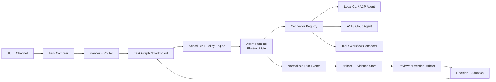

# Meldwork Harness Engine 与 Agent Team 商业化战略

> 日期：2026-08-02
>
> 状态：产品与技术战略建议，不代表当前已交付能力
>
> 关联文档：[产品迭代规划](product-iteration-plan.md)、[产品 BP](product-bp.md)、[架构](architecture.md)、[自动化](automation.md)

## 0. 直接结论

**建议有条件推进。** 用户提出的方向成立，但需要把目标从“接入所有支持 CLI 的 Agent”升级为：

> **把本地、自研和云端的异构 Agent 变成可发现、可调度、可约束、可恢复、可评估的工作单元，并让它们以最低必要协作成本交付可采用、可验证的结果。**

推荐的产品主链路是：

```text
Any Agent
  -> Connector Contract
  -> Harness Run
  -> Task Graph / Blackboard
  -> Artifact / Evidence
  -> Decision / Adoption
```

这条路线有创业价值，但有三个前提：

1. **“任意 CLI”是入口，不是壁垒。** 适配数量很容易被复制，也会被 ACP、A2A、MCP、AG-UI 等开放协议逐步商品化。
2. **多 Agent 不是默认答案。** 默认先用一个最合适的 Agent；只有任务可拆分、能力互补、风险需要独立复核或证据存在冲突时，才增加 Agent。
3. **商业化卖的是交付能力，不是 Agent Logo。** 客户为更低的协调成本、更高的成功率、可验证的结果、组织策略和私有部署付费，而不是为“一个窗口里有很多 Agent”付费。

因此，Meldwork 的核心创新不应是通用聊天聚合器，也不应直接与模型公司竞争“最强 General Agent”。更合理的定位是：

> **跨厂商、Local-first 的 Agent Harness 与 Outcome Control Plane。**

12 个月内只需要证明一件事：一个小团队能否依靠 Meldwork 的 Harness 和两个业务 Agent Pack，持续比手工切换 Agent 更快、更稳地交付经过验证的结果。如果不能证明，应收缩为“单 Agent + Knowledge + Outcome”的个人工具，而不是继续堆叠 Swarm。

## 1. Harness Engine 应该解决什么

### 1.1 定义

Harness Engine 是位于“用户任务意图”和“具体 Agent Runtime”之间的执行控制层。它不替代 Agent 的专业能力，而是决定：

- 哪个 Agent 应该参与。
- Agent 能看到什么上下文、使用什么 Provider、获得什么权限。
- 工作如何拆解、并行、暂停、复核和恢复。
- 哪些输出属于可继续使用的 Artifact。
- 哪些证据足以支持结果和最终 Decision。
- 这次协作是否比单 Agent 更好、更快或更便宜。

可以用一个简单公式理解其价值：

```text
有效交付价值
= Agent 专项能力 x 任务匹配度 x 上下文质量 x 可控性 x 可验证性
- 协调成本 - Token/时间成本 - 失败与返工成本
```

### 1.2 对用户四点理解的补全

用户提出的前三点是正确的，建议扩展为六点：

1. **更低成本地交付更好结果**：路由到最合适的 Agent，只在可并行或高风险场景增加 Agent，压缩重复上下文和无效讨论。
2. **更稳定、更可控**：权限、预算、超时、取消、Checkpoint、重试、降级和 Human Gate 都由 Harness 统一管理。
3. **更易扩展**：Agent 通过 Connector Manifest 和协议能力加入，而不是不断在业务代码里增加 `if kind === ...`。
4. **可观测、可评估**：每次 Run 都有统一事件、Artifact、Evidence、成本、耗时、失败原因和回归评测。
5. **可组合、可复用**：被证明有效的任务拆解、Review Policy 和交付标准可以固化成有版本的 Workflow 或 Agent Pack。
6. **可治理、可审计**：组织可以规定哪些数据能出站、哪些 Agent 能写入、什么任务必须复核、什么结果可以自动采用。

### 1.3 Harness 的五个平面

| 平面 | 责任 | 用户价值 |
| --- | --- | --- |
| Connector Plane | 发现、安装、调用本地 CLI、ACP Agent、A2A Agent 和云 API | Agent 可替换，避免被单一厂商锁定 |
| Control Plane | 权限、Provider、预算、取消、超时、Session、Checkpoint 和恢复 | 稳定、可控、可追责 |
| Coordination Plane | Task Graph、路由、调度、问题定向、Review 和裁决 | 减少无效全员讨论 |
| Outcome Plane | Artifact、Evidence、Decision、Adoption 和导出 | 从“说了什么”升级为“交付了什么” |
| Evaluation Plane | 场景评测、兼容测试、质量/成本回归和 Agent Fit Matrix | 能基于证据选择 Agent，而不是凭品牌选择 |

## 2. 为什么方向成立，但不能只做连接层

### 2.1 外部证据给出的边界

Anthropic 在《Building effective agents》中建议从最简单的方案开始，再按任务采用 Routing、Parallelization、Orchestrator-workers 或 Evaluator-optimizer，而不是默认建立复杂自治系统。

Anthropic 公开的多 Agent Research 系统在其内部研究评测中相对单 Agent 提升 90.2%，但同时披露多 Agent 系统平均消耗约为普通聊天的 15 倍 Token；需要共享完整上下文、Agent 间依赖很强的任务，并不适合当前多 Agent 架构。这个结果说明，多 Agent 的价值来自**可并行的高价值任务**，不是 Agent 数量本身。

论文《Towards a Science of Scaling Agent Systems》在 260 种配置上的结果更直接：多 Agent 相对单 Agent 的变化范围从 `+80.8%` 到 `-70.0%`。工具密集任务存在明显协调开销，无中心验证的架构也更容易传播错误。结论不是“多 Agent 有效”或“无效”，而是**任务结构与协作架构是否匹配决定结果**。

Magentic-One 的启发同样不是“让所有 Agent 自由聊天”，而是让 Orchestrator 负责规划、跟踪、重规划和恢复，专业 Agent 按需参与。

### 2.2 连接层正在标准化

| 协议 | 主要解决的问题 | Meldwork 应如何使用 |
| --- | --- | --- |
| MCP | Agent 连接工具、数据和资源 | 作为 Tool/Knowledge 接口，不把 MCP Server 都称为 Agent |
| ACP | 客户端或编辑器连接 Coding Agent | 优先用于支持 Session、取消、权限和结构化事件的本地 Agent |
| A2A | 不同 Agent 通过 Agent Card、Task、Message、Artifact 协作 | 用于未来云 Agent 与跨组织 Agent，而不是替代本地 CLI |
| AG-UI | Agent Runtime 与前端之间的事件流 | 参考其事件模型，Renderer 仍只通过受限 Preload 访问主进程 |

Meldwork 不需要再发明一个互不兼容的“万能 Agent 协议”。它需要做的是：

- 对协议原生 Agent 直接适配。
- 对传统 CLI 提供受控 Wrapper。
- 把不同协议归一为 Meldwork 的 Task、Run、Artifact、Evidence 和 Decision 模型。
- 通过兼容认证与真实场景评测告诉用户“哪个 Connector 在什么条件下可靠”。

### 2.3 竞争位置

| 类型或产品 | 已占据的优势 | Meldwork 不应硬碰的部分 | 可建立差异的部分 |
| --- | --- | --- | --- |
| GitHub Agent HQ | GitHub 工作入口、并行 Coding Agent、治理和任务可见性 | 不复制 GitHub 原生开发入口 | 跨代码、研究、知识平台和本地 Agent 的中立工作层 |
| Warp Oz | 云端 Agent 并行执行、运行环境、审计与 Workflow | 不先建设重型 Cloud Runner | Local-first、BYO Agent、私有上下文和本地 Handoff |
| OpenHands Agent Canvas | 本地/远程/云 Backend、ACP Agent、自动化 | 不做另一个纯 Coding Agent Control Center | 业务 Pack、Evidence/Adoption 和跨领域 Connector 评测 |
| LangGraph / AutoGen / CrewAI | 开发者可编程的多 Agent 框架 | 不与框架争夺 Python 编排开发者 | 面向终端用户的安装、治理、评测和交付体验 |
| 单厂商 General Agent | 模型、原生工具、Session 和推理能力 | 不训练自有通用模型 | 中立路由、专业 Agent 组合和结果可迁移性 |

竞争产品已经证明“一个控制面可以启动多个 Agent”会很快成为基础能力。Meldwork 必须比这个基础层多交付三样东西：

1. **跨厂商兼容可信度。**
2. **场景化 Agent Team 的可复用交付协议。**
3. **Artifact、Evidence、Decision 与 Adoption 形成的数据闭环。**

## 3. Meldwork 当前基础与关键缺口

### 3.1 已有基础

当前仓库并不是从零开始：

- Electron Main 已经是 Agent 执行、Provider、权限和本地持久化的信任边界。
- `desktop/src/cli-adapters.cjs` 已支持多种本地 CLI 的发现、参数、结构化输出解析、Session 和取消差异。
- `desktop/src/run-harness.cjs` 已有统一流式事件、上下文预算、Session 轮换和 Evidence Capsule 的基础。
- `desktop/src/local-workspace.cjs` 已有有界自动讨论、超时、停止、失败隔离和运行状态。
- Provider Key 已通过操作系统安全存储保护，Renderer 不接触原始凭据和可执行路径。
- 当前实现已加入 OpenCodeReview，能够把当前 Workspace Diff 交给 `ocr review`，并通过兼容 Provider 注入运行。

这说明 Harness 并非纯概念，现有代码已经具备 Runtime 和安全边界的第一层。

### 3.2 OpenCodeReview 实验说明了什么

OpenCodeReview 是合适的第一项专项 Agent 实验，因为它不是“再接一个聊天模型”，而是把确定性文件选择、规则匹配、评论定位和专业 Review Agent 结合起来。其官方 Benchmark 声称，在相同底层模型下相对通用 Agent 获得更高 Precision/F1，并大幅减少 Token；该数据属于项目方自报，需要由 Meldwork 独立复验，但方向本身说明了专项 Harness 的价值：

> 专项 Agent 的优势往往来自“确定性工程约束 + 领域工具 + 场景 Prompt + 评测数据”，而不仅是模型更强。

当前适配也暴露了下一步缺口：OpenCodeReview 在 Meldwork 中目前以文本格式接入、没有接入统一 Session 生命周期，并被标记为 `connector_limited`。这正适合作为 Connector Contract 的第一个升级样本，而不是继续为每个 Agent 增加一次性分支。

### 3.3 最大缺口

| 当前状态 | 结构问题 | 目标状态 |
| --- | --- | --- |
| Agent、命令、参数和 Parser 硬编码 | 每增加一个 Agent 都修改主逻辑 | Manifest + 主进程受控 Recipe + Connector SDK |
| Durable Center 仍是 Conversation | 能看到消息，难以回答任务是否完成 | Task / Run / Artifact / Evidence / Decision |
| 自动讨论按完整轮次顺序调用所有 Agent | 无关 Agent 也消耗时间和上下文 | 事件驱动 Task Graph，Agent 默认沉默 |
| 共识依赖 Agent 自报标记 | 一致不等于正确，分歧也可能有价值 | Evidence Gate、Verifier、Arbiter 和 Human Decision |
| 输出仍以 Final Text 为中心 | 代码、报告、引用和测试不够结构化 | Typed Artifact + Evidence Bundle |
| 能看到单次运行事件 | 缺少跨版本、跨 Agent 的回归数据 | Eval Harness + Agent Fit Matrix |
| Installer 使用可变上游包或脚本 | 供应链与兼容退化风险 | Pin、Checksum、签名、隔离安装和认证状态 |

## 4. 目标架构



### 4.1 核心组件

| 组件 | 责任 | 最小实现 |
| --- | --- | --- |
| Task Compiler | 把用户目标转成约束、验收标准和预期 Artifact | 用户确认后的结构化 Task，不自动臆造高风险权限 |
| Capability Registry | 记录 Agent、Tool 和 Workflow 的能力、版本和限制 | 本地 Manifest、健康状态、兼容等级 |
| Planner / Router | 决定单 Agent、多 Agent模式和任务拆分 | 先规则路由，再引入基于评测数据的模型路由 |
| Task Graph / Blackboard | 存放子任务、依赖、问题、Artifact、Evidence 和冲突 | 本地持久化事件图，不复制所有 Agent 私有思维过程 |
| Scheduler | 管理并发、预算、优先级、重试、暂停和取消 | 每 Workspace/Task/Agent 有界队列 |
| Agent Runtime | 启动、监控并终止本地或远程 Agent | 保持在 Electron Main，不向 Renderer 暴露任意执行 |
| Policy Engine | 判断读写、网络、数据出站、审批和采用规则 | 默认只读、显式写入、任务级 Human Gate |
| Artifact / Evidence Store | 捕获交付物、来源、测试和审查结果 | App-owned 本地对象，支持导出与复验 |
| Eval Harness | 在固定任务集上比较 Agent/Workflow 版本 | 质量、成本、耗时、失败和安全回归 |

### 4.2 Local-first 与安全边界保持不变

- Renderer 只能提交 `connectorId`、Task、已选上下文和授权意图。
- 可执行文件解析、命令 Recipe、环境变量、Secret 注入、进程树和网络策略都由 Main 控制。
- Manifest 不能把 Renderer 输入直接拼成 Shell 命令。
- Secret 只以安全存储引用存在，Connector 运行时按最小范围注入，不写入日志、Artifact 或导出包。
- Cloud Agent 可以成为 Connector，但不要求把本地 Conversation、完整 Context Pack 或工作状态复制到 Meldwork 云端。
- 写入 Workspace、发送外部消息、提交代码、创建 PR、发布文档等动作必须有独立 Policy 和审批边界。

## 5. Agent Connector Contract

### 5.1 先区分 Agent、Tool 和 Workflow

| 类型 | 判断标准 | 示例 |
| --- | --- | --- |
| Agent Connector | 能接收目标、动态规划或调用工具，并返回结果 | OpenCodeReview、gptme、mini-SWE-agent、PaperQA2 |
| Tool Connector | 提供确定性能力，由 Agent 或 Workflow 调用 | Browser、Git、测试命令、MCP Server |
| Workflow Connector | 按预定义 Pipeline 处理结构化输入输出 | DocETL、固定报告生成 Pipeline |

这个分类很重要。把所有 CLI 都称为 Agent，会让路由、权限和评测失去意义。

### 5.2 Manifest 最小字段

下面是概念结构，不是直接允许执行的配置格式：

```json
{
  "schemaVersion": 1,
  "id": "example.agent",
  "version": "1.2.0",
  "kind": "agent",
  "transport": {
    "type": "cli",
    "protocol": "jsonl"
  },
  "discovery": {
    "commands": ["example"],
    "versionRange": ">=1.2 <2"
  },
  "invocation": {
    "recipeId": "example.agent.run"
  },
  "capabilities": {
    "domains": ["software-review"],
    "sessions": true,
    "resume": true,
    "cancel": true,
    "checkpoint": false,
    "structuredOutput": true
  },
  "permissions": {
    "workspaceRead": "required",
    "workspaceWrite": "optional",
    "network": "required",
    "sandbox": "supported"
  },
  "artifacts": ["review-report"],
  "evidence": ["file-location", "finding", "usage"],
  "provider": {
    "mode": "compatible",
    "secretRef": "os-secure-storage"
  },
  "license": "Apache-2.0"
}
```

`recipeId` 必须指向 Meldwork Main 中经过审核或签名的调用 Recipe。Manifest 本身不能提供任意 Shell 片段。

完整 Contract 至少要声明：

- 发现、安装、版本、升级、卸载和健康检查。
- 输入方式：参数、stdin、文件、ACP、A2A 或 HTTP。
- 输出方式：文本、JSON、JSONL、事件流和退出码语义。
- Session、Resume、Cancel、Checkpoint、Retry 和幂等性。
- Workspace 读写、网络、浏览器、Shell、外部消息和审批需求。
- Provider 类型、数据出站目标、Secret 映射和用户自带账号要求。
- Artifact 类型、Evidence 类型、成本、耗时和使用量可观测性。
- License、上游来源、依赖、已知漏洞和支持平台。

### 5.3 兼容等级

| 等级 | Contract 能力 | 产品承诺 |
| --- | --- | --- |
| L0 Text | 非交互文本输入输出、退出码和超时 | 可调用，但结果需要人工整理 |
| L1 Structured | JSON/JSONL、结构化状态和 Artifact | 可稳定显示和捕获结果 |
| L2 Managed | Session、取消、权限、Usage、Checkpoint 或可恢复状态 | 可进入有界 Workflow |
| L3 Protocol-native | ACP/A2A 等协议原生，事件和生命周期完整 | 可参与动态 Task Graph |
| Certified | 通过 Meldwork 场景评测、安全、取消、故障恢复和版本回归 | 可进入官方 Agent Pack 和企业支持矩阵 |

“支持”与“认证”必须分开。社区可以提交 L0/L1 Connector，但官方 Pack 只使用经过认证的版本组合。

### 5.4 统一运行事件

建议在当前 Run Event 基础上逐步支持：

```text
TaskProposed        TaskClaimed          RunStarted
ProgressUpdated     PermissionRequested  CheckpointSaved
ArtifactPublished   EvidenceAttached     ReviewRequested
QuestionDirected    ObjectionRaised      DecisionProposed
DecisionAccepted    RunCompleted         RunFailed / RunCancelled
```

Connector 可以保留自己的 Raw Event，但进入产品状态、日志和 UI 前必须归一化、限长和脱敏。

## 6. 从轮询讨论升级为动态 Agent Team

### 6.1 当前自动讨论为什么不够

当前实现会让所有目标 Agent 按完整轮次顺序发言，默认 6 轮，最多 10 轮或 30 分钟，并以全员同轮自报一致作为提前结束条件。它是安全有界的 MVP，但存在四个结构问题：

- C、D 即使没有任务或新信息也必须发言。
- 后发 Agent 被迫消费前序消息，成本随轮次和 Agent 数快速增长。
- “达成共识”依赖模型自报，不能证明结论正确。
- 任务进度隐藏在聊天顺序里，不能独立重试、复核或恢复一个子任务。

### 6.2 推荐模型：中心协调、分布执行、证据裁决

建议采用 **Task Graph + Blackboard + Event-driven Activation**：

- Task Graph 表达子任务、依赖、验收条件和预算。
- Blackboard 记录可共享的 Artifact、Evidence、问题、异议和 Decision，不要求共享所有 Agent 完整对话。
- Planner/Orchestrator 负责计划、状态和重规划。
- Worker 并行执行可独立的子任务。
- Reviewer 和 Verifier 按风险或 Evidence 缺口触发。
- Arbiter 在冲突无法通过确定性证据消解时提出选项，不伪造共识。

Planner、Worker、Reviewer、Verifier、Arbiter 是**运行时角色**，不应永久绑定某个 Agent。OpenCodeReview 可以在代码任务中承担 Reviewer，但在研究任务中没有必要出现。

### 6.3 Agent 默认沉默

一个 Agent 只有在以下条件之一成立时才被激活：

1. 被明确分配了未完成子任务。
2. 收到另一个 Agent 的定向问题。
3. Policy 要求独立 Review 或 Verification。
4. 新 Evidence 与它负责的 Artifact 冲突。
5. 当前 Agent 失败、超时或能力不足，需要接管。
6. 用户明确要求独立观点或对抗性审查。

没有任务、没有问题、没有新证据时，Agent 保持沉默。这一条比“让讨论更像真人”更重要，因为它直接降低成本并提高可读性。

### 6.4 协作模式由任务结构决定

| 任务特征 | 默认模式 | 不应使用的模式 |
| --- | --- | --- |
| 共享上下文很大、步骤强依赖 | 单 Agent + Checkpoint | 多 Agent 全量复制上下文 |
| 子任务可独立并行、覆盖面重要 | Orchestrator-workers | 固定顺序轮询 |
| 有清晰类别或能力映射 | Router | 所有 Agent 都尝试 |
| 高风险产物需要独立检查 | Primary + Reviewer + Verifier | 自报共识 |
| 方案空间开放、需要多样观点 | 2-3 个独立 Attempt + Arbiter | 长轮次自由辩论 |
| 输出可通过测试或规则检查 | Evaluator-optimizer | 仅靠语言互评 |

### 6.5 A、B、C、D 的目标交互

假设用户交给四个 Agent 一个复杂任务：

1. Planner 生成 `T1 调研`、`T2 实施`、`T3 Review`、`T4 验证`，并标记依赖。
2. A 负责调研，C 同时负责可独立实施的部分；B、D 此时保持沉默。
3. A 发布 Evidence，C 发布 Artifact。
4. B 因 Review Policy 被激活，只检查 C 的 Artifact 和验收标准。
5. B 对 A 的一项 Evidence 提出定向问题，只有 A 和 B 进入局部讨论；C 可以继续修复其他 Finding，D 仍保持沉默。
6. D 只在测试、引用或权限验证阶段被激活，发布可复验 Evidence。
7. 如果 B 的异议被测试消解，Task 进入 Decision；如果无法消解，Arbiter 把分歧、证据和选项交给用户，而不是要求四个 Agent 继续发言。

这才是“像团队一样工作”：不是每个人按顺序讲话，而是每个角色在需要时承担责任。

### 6.6 决策不能等于共识

建议使用以下结束条件：

- 验收标准全部有对应 Artifact。
- 必需 Evidence 已达到 `Observed` 或 `Reproduced`，不能只有 Agent 的 `Declared`。
- 高优先级 Reviewer Finding 已关闭、接受风险或提交 Human Gate。
- 测试、引用、Schema 或 Policy Gate 通过。
- 成本、时间和 Review Loop 没有超过预算。

保留未解决分歧比伪造全员一致更可信。

### 6.7 自治等级

| 等级 | 能力 | 默认人类位置 |
| --- | --- | --- |
| A0 Assist | Agent 给建议，不执行 | 每步决定 |
| A1 Execute | 单 Agent 完成一个有界 Task | 结果验收 |
| A2 Review | Primary + Reviewer，允许一次修订 | 最终采用 |
| A3 Team | Task Graph、局部协作、Checkpoint 和故障接管 | 权限/预算/高风险 Gate |
| A4 Policy-autonomous | 对预先批准的重复 Workflow 无人值守运行 | 异常和最终抽查 |

近期目标是可靠达到 A2，再在两个业务 Pack 中验证 A3。不要把任意任务的 A4 当作近期承诺。

## 7. 评测系统与真正的产品壁垒

### 7.1 Agent Fit Matrix

每次认证和用户运行应逐步形成以下矩阵：

```text
Task Type x Agent x Connector Version x Model/Provider x OS x Permission Mode
  -> Quality / Cost / Latency / Failure / Evidence / Adoption
```

路由器先使用显式规则和本地历史，再考虑模型预测。用户数据默认留在本地；只有用户单独同意时，才上传不含 Prompt、原文、Artifact 和 Secret 的最小派生指标。

### 7.2 每个 Agent Pack 都需要固定评测集

至少覆盖：

- 正常任务、模糊任务和不可完成任务。
- 权限不足、Provider 失败、CLI 升级和输出格式变化。
- 中断、取消、Resume、Checkpoint 和超时恢复。
- 恶意 Prompt、Workspace 中的非可信指令和 Secret 泄漏测试。
- Artifact 完整性、Evidence 可复验性和 Human Adoption。

### 7.3 五层壁垒

| 壁垒 | 为什么能积累 |
| --- | --- |
| Connector Compatibility Data | 哪个版本在什么 OS、Provider 和权限下真实可用，需要持续测试和故障数据 |
| Task-specific Evaluation | 专项 Agent 是否比通用 Agent 更好，需要真实任务、评分标准和回归历史 |
| Outcome & Evidence Graph | 记录什么结果被采用、什么 Evidence 真正有效，形成跨 Agent 的工作记忆 |
| Business Agent Packs | 把行业交付标准、角色、Policy 和 Workflow 产品化，而不是卖一次性 Prompt |
| Trust & Governance | 本地控制、权限、审计、签名 Connector 和企业支持形成迁移成本 |

开源代码本身不是壁垒。若这些数据、协议和业务 Pack 没有形成，项目就仍然只是一个可复制的 Wrapper。

## 8. 首发业务 Agent Pack

首发只建议做两个 Pack。它们场景差异足够大，可以验证 Harness 是否通用；又能共享 Task、Artifact、Evidence、Review 和 Decision 核心对象。

### 8.1 Software Delivery Pack

**目标客户：** 3-30 人研发团队、外包交付团队、AI Coding 高频个人开发者。

**推荐团队：**

- Implementer：用户已有 Coding Agent。
- Reviewer：OpenCodeReview。
- Verifier：确定性测试、Lint、构建命令；必要时增加第二 Agent 解释失败。
- Arbiter：只在 Review Finding 与测试证据冲突时加入。

**工作协议：**

```text
Issue / Task
  -> Plan
  -> Code Artifact
  -> OpenCodeReview Findings
  -> Targeted Revision
  -> Test Evidence
  -> Human Apply / Commit / Reject
```

**可售价值：** 更少人工整理、更高 Finding Precision、可追溯测试证据、跨 Coding Agent 的统一 Review Policy。

**首轮指标：**

- 相对“单 Coding Agent 自检”，高优先级缺陷发现率提升至少 15%。
- Reviewer 被人类接受的 Finding Precision 至少 70%，并持续记录误报。
- 完成相同验收标准时，主动人工协调时间中位数下降至少 25%。
- 多 Agent 总成本不超过最佳单 Agent 基线的 2.5 倍；超过时必须证明返工或风险显著下降。

### 8.2 Research Evidence Pack

**目标客户：** 研究、咨询、产品战略、投研和需要引用依据的知识团队。

**推荐团队：**

- Researcher：GPT Researcher、gptme 或其他 Web Research Agent。
- Literature Specialist：PaperQA2，处理用户提供或授权的科学文献集合。
- Source Verifier：检查来源可访问性、引用与主张对应关系。
- Reviewer：检查遗漏、冲突、时间口径和结论过度外推。

**工作协议：**

```text
Research Question
  -> Search Plan
  -> Parallel Source Tasks
  -> Evidence Cards
  -> Draft Artifact
  -> Citation / Claim Verification
  -> Decision Brief
  -> Human Adopt / Request Revision
```

**可售价值：** 来源透明、研究过程可复盘、引用与主张可追踪、不同 Research Agent 的结果可比较。

**首轮指标：**

- 95% 的核心事实主张能链接到具体 Evidence。
- 抽样引用中，主张与来源匹配率至少 90%。
- 相对单 Agent，重要来源覆盖或有效结论评分提升至少 15%。
- 若多 Agent 成本超过单 Agent 3 倍，必须把研究广度、引用质量或交付速度的提升量化，否则退回单 Agent。

### 8.3 暂不作为首发 Pack

- Security/Pentest：权限和法律风险高，只能在客户书面授权环境中验证。
- 浏览器自动化：可作为 Tool 或受限 Agent Connector，不能默认获得账号、支付、发布和消息权限。
- 大规模文档 ETL：DocETL 更适合作为 Workflow Connector，待 Task/Artifact Contract 稳定后加入。
- 通用“十人专家团”：缺少明确 Artifact 和验收标准，不构成产品 Pack。

## 9. GitHub CLI Agent 候选矩阵

下面的优先级是接入研究建议，不是当前支持承诺。License 和依赖商业条款必须在每次发行和企业打包前重新核对。

| 项目 | 类型 | 专项能力与接口 | 建议角色 | 优先级 | 主要风险 |
| --- | --- | --- | --- | --- | --- |
| [OpenCodeReview](https://github.com/alibaba/open-code-review) | Agent | `ocr review/scan`、代码审查、Session、行级 Finding；Apache-2.0 | Software Reviewer | P0，当前首个样本 | 当前 Meldwork 仅文本接入；官方 Benchmark 需独立复验 |
| [gptme](https://github.com/gptme/gptme) | Agent | 非交互模式、JSONL、Resume、MCP、ACP；MIT | Connector Contract 基准、通用 Worker | P0 | 权限面广，需明确 Tool Policy 和 Sandbox |
| [PaperQA2](https://github.com/Future-House/paper-qa) | Agent | `pqa ask`、本地论文索引、引用回答；Apache-2.0 | Literature Specialist | P0 | 索引成本、元数据服务和引用许可边界 |
| [mini-SWE-agent](https://github.com/SWE-agent/mini-swe-agent) | Agent | `mini` CLI、Issue 修复、Trajectory、本地/容器环境；MIT | Software Implementer 对照组 | P1 | Shell 权限、长运行和 Workspace 副作用 |
| [Open Interpreter](https://github.com/OpenInterpreter/openinterpreter) | Agent | ACP、Codex exec 协议、跨平台 Sandbox；Apache-2.0 | Protocol-native Worker | P1 | 执行能力强，必须验证审批与 Sandbox 真实边界 |
| [GPT Researcher](https://github.com/assafelovic/gpt-researcher) | Agent/框架 | Web Research、并行检索、引用报告；Apache-2.0 | Web Researcher | P1，需要 Wrapper | CLI/库输出需归一，搜索 Provider 和成本依赖较多 |
| [DocETL](https://github.com/ucbepic/docetl) | Workflow | `docetl run pipeline.yaml`、结构化文档 ETL；MIT | Document Workflow | P1，按 Workflow 接入 | 不应伪装成自主 Agent；Pipeline 写入和成本需声明 |
| [SWE-agent](https://github.com/SWE-agent/SWE-agent) | Agent | `sweagent run`、完整 Trajectory、Docker 默认；MIT | 重型 Coding 对照组 | P2 | 安装和容器成本高，不符合默认轻量体验 |
| [STORM](https://github.com/stanford-oval/storm) | Agentic System | 多阶段研究与带引用长报告；MIT | Research Workflow 参考 | P2，观察 | 稳定 CLI Contract 和维护活跃度弱于首选项 |
| [browser-use](https://github.com/browser-use/browser-use) | Agent/Tool | 浏览器控制和 Web Agent；MIT | Browser Worker | P2，受限实验 | 账号、Cookie、外部副作用和 Prompt Injection 风险高 |
| [PentestGPT](https://github.com/GreyDGL/PentestGPT) | Agent Framework | 渗透测试任务编排；MIT | 授权安全 Pack | 暂缓 | 法律、网络扫描、破坏性操作和责任边界 |

### 9.1 接入评分门槛

建议按 100 分评估：

| 维度 | 分值 | 关键问题 |
| --- | ---: | --- |
| 接口成熟度 | 20 | 是否非交互、结构化、可取消、可 Resume、错误语义稳定 |
| 安全与权限 | 20 | 是否可只读、Sandbox、限制网络和外部副作用 |
| Artifact / Evidence | 20 | 是否能交付结构化产物、来源、Finding、Trajectory 或测试 |
| 稳定与维护 | 15 | 版本节奏、测试、跨平台、失败恢复和可 Pin |
| 场景差异化 | 15 | 是否在专项任务中明显优于已有通用 Agent |
| License 与运维 | 10 | 商业许可、依赖、安装体积和支持成本 |

- 低于 60 分：不接入。
- 60-74 分：社区实验，不进入官方 Pack。
- 75-84 分：Pilot Connector。
- 85 分以上且通过回归：Certified Connector。

接入目标不应是“每月新增多少 Agent”，而应是“一个外部贡献者能否在不修改核心调度代码的情况下，于一天内完成 L1 Connector，并通过固定 Contract Test”。

## 10. 商业化路径

### 10.1 收入结构

| 层级 | 交付内容 | 收费理由 |
| --- | --- | --- |
| Community | Local-first 核心、基础 Connector、Task/Artifact 协议 | 建立信任、生态和贡献入口 |
| Pro | 官方 Agent Pack、评测比较、Evidence 导出、Workflow 版本 | 为个人持续交付和节省时间收费 |
| Team | 共享 Policy、预算、Workflow、兼容报告和可选同步 | 为团队一致性和管理成本收费 |
| Enterprise | 私有部署、签名 Connector、离线更新、审计、RBAC 和 SLA | 为风险、治理和支持责任收费 |
| Services | 按客户业务部署一套 Agent Team，并完成首批 Workflow | 用真实项目发现需求并资助产品化 |

不建议默认对模型 Token 加价。BYO Agent、BYO Provider、BYO Knowledge 能降低毛利风险，也更符合中立控制层定位。

### 10.2 价格验证区间

以下仅用于付款意愿测试，不是正式定价：

| 产品 | 建议测试区间 |
| --- | ---: |
| Pro | 99-199 元/月 |
| Team | 199-399 元/用户/月，或 1,999 元/月 Workspace 起 |
| Enterprise | 20-80 万元/年，按私有部署、治理和 SLA 范围报价 |
| 标准化 Pilot Service | 5-20 万元/4-8 周，只交付一个业务 Pack |

价格不能先于价值验证。首批收费更重要的指标是：客户是否愿意为相同标准化能力续费，而不是一次定制项目金额。

### 10.3 适合 OPC 的服务产品化路径

1. 用“Agent Team 交付诊断”进入客户：识别重复任务、数据边界、验收标准和当前人工成本。
2. 只售卖固定范围 Pilot：一个 Pack、一个部门、2-3 个 Workflow、明确成功指标。
3. 客户特有逻辑放在 Connector/Policy/Template，核心 Engine 不接受单客户分叉。
4. 每个定制需求必须回答“是否能被至少三家同类客户复用”；不能复用则按高价服务交付，不进入主产品。
5. 服务收入与标准化软件收入分开核算，避免把创始人的工时误认为产品增长。

OPC 可承受的运营门槛建议是：

- 认证 Connector 数量保持在 5-8 个，而不是无限扩张。
- 单客户月均支持时间低于 4 小时。
- 除模型费用外的软件毛利目标高于 75%。
- 连续两个季度，标准化产品和 Pack 收入占总收入至少 60%。
- 任何单一客户不应长期贡献超过 35% 收入。

### 10.4 首批 ICP 与销售动作

优先两类客户：

- 已经同时使用两种以上 Coding Agent、代码交付频繁、Review 人力不足的小研发团队。
- 每周重复产出研究、咨询或决策报告，且对来源、引用和复核有明确要求的知识团队。

销售路径：

```text
现状诊断
  -> 用客户真实任务做单 Agent 基线
  -> 部署一个 Agent Pack
  -> 比较质量 / 成本 / 人工时间
  -> 交付 Evidence 与兼容报告
  -> 续费软件或私有部署
```

## 11. 12 个月路线图

### Phase A：Contract 与 Outcome 基础，0-6 周

**交付：**

- Task、Run、Artifact、Evidence、Decision 的本地最小模型。
- Agent Connector Manifest v0 和 Contract Test Harness。
- 把 OpenCodeReview 从一次性适配升级为首个 L1/L2 样本。
- 选择 gptme 或另一个结构化 CLI 作为第二种实现，验证 Contract 不是为 OCR 特制。
- 20 个 Software Delivery 基准任务，记录单 Agent 基线。

**阶段门：**

- 任何 Secret 不进入 Renderer、日志、Artifact 和导出包。
- 取消后的进程树清理成功率至少 99%。
- Artifact 捕获完整率至少 90%。
- 新 Connector 不修改 `local-workspace.cjs` 的业务分支。

### Phase B：Software Delivery Pack，6-12 周

**交付：**

- Primary + OpenCodeReview + Deterministic Verifier 工作协议。
- Finding、修订、测试 Evidence 和 Human Adoption 界面。
- 单 Agent 与 Pack 的质量、成本和耗时对照。
- 5 个外部设计伙伴、至少 30 个真实 Task。

**阶段门：**

- 至少 70% 的高优先级 Review Finding 被用户接受。
- 人工协调时间中位数下降至少 25%。
- 至少 3 个设计伙伴在 30 天内重复使用。
- 若 Pack 不优于最佳单 Agent，则停止增加 Coding Agent，先修 Workflow 和 Evidence。

### Phase C：Research Evidence Pack 与事件驱动协作，3-6 个月

**交付：**

- PaperQA2 加一个 Web Research Agent 的 Pilot Connector。
- Evidence Card、Claim-Citation Link 和 Source Verification。
- Task Graph、定向问题、Review Request、Objection 和 Agent 默认沉默。
- Connector 兼容等级和本地认证报告。

**阶段门：**

- 15 名固定用户中至少 8 名完成 30 天重复 Outcome。
- 研究核心主张的 Evidence 覆盖率至少 95%。
- 多 Agent 只在已验证任务类型中启用，质量提升至少 15% 或返工下降至少 25%。
- 至少一个外部贡献的 Connector 或 Eval Task 被合并。

### Phase D：动态路由、恢复与付费 Pilot，6-9 个月

**交付：**

- 基于任务类型、能力、预算和本地评测的 Router。
- Checkpoint、失败接管、Agent 替换、重试和降级到单 Agent。
- Workflow 版本、Policy Pack 和 Evidence Bundle 导出。
- 3 个标准化付费 Pilot，服务与软件收入分别核算。

**阶段门：**

- Run 成功或可解释失败率至少 95%。
- Connector 版本退化能在发布前被 Contract/Eval Test 捕获。
- 单客户月均支持时间低于 8 小时，并持续下降。
- 至少 2 个客户愿意为同一 Pack 续费，而不是购买新定制。

### Phase E：Team / Enterprise 条件阶段，9-12 个月

**进入条件：** 至少 3 个团队为同一标准化能力付费，且重复使用和支持成本成立。

**候选交付：**

- 共享 Workflow、Policy、预算和兼容矩阵。
- 签名 Connector、离线更新、RBAC、审计和可选加密同步。
- 对预先批准 Workflow 的 A4 Policy-autonomous 运行。
- 企业部署工具和 SLA，而不是为每个客户维护独立分支。

## 12. 指标体系

### 12.1 北极星

**每周被实际采用并完成验证的 Artifact 数。**

不以 Agent 数、消息数、轮次数或自动运行时长作为成功指标。

### 12.2 产品与质量

- 首次 Verified Artifact 完成时间。
- Task 完成率、Adoption 率和 Reopen 率。
- Reviewer Finding Precision、有效缺陷增量和误报率。
- Evidence 覆盖率、可复验率和来源失效率。
- 相对最佳单 Agent 的质量提升、返工下降和人工协调时间下降。

### 12.3 Harness 与扩展性

- Run 取消、超时和恢复成功率。
- Session Resume、Checkpoint 和 Artifact 捕获完整率。
- 新 L1 Connector 的开发时间。
- Certified Connector 的版本回归率和平均修复时间。
- 多 Agent 协调开销：额外 Token、等待、重复上下文和无效激活次数。

### 12.4 商业

- 设计伙伴到付费 Pilot 转化率。
- Pilot 到续费/年付转化率。
- 标准化收入与定制服务收入占比。
- 单客户支持工时、部署时间和贡献毛利。
- 同一 Pack 的付费客户数，而不是总客户数。

### 12.5 安全

- Secret 泄漏和权限越界事件必须为 0。
- 未经批准的 Workspace 写入和外部副作用必须为 0。
- 高风险任务 Human Gate 覆盖率 100%。
- Connector 安装来源、版本和校验信息可追溯率 100%。

## 13. 停止条件与收缩策略

| 观察 | 决策 |
| --- | --- |
| 15 名固定用户中少于 8 名完成 30 天重复 Outcome | 不扩 Cloud/Team，先收缩激活与 Outcome 闭环 |
| 多 Agent 在目标任务上质量提升低于 10%，且成本超过单 Agent 2.5-3 倍 | 停止 Swarm，保留单 Agent + Reviewer |
| Connector 维护连续两个月占创始人时间超过 30% | 缩减认证列表，优先协议原生 Agent 和社区维护 |
| 两个 Pack 共享的核心 Engine 低于约 70% | 不再声称通用 Harness，选择一个垂直场景 |
| 超过 50% Pilot 收入来自不可复用定制，且复用率不提升 | 把业务定义为服务公司，或停止该垂直方向 |
| 出现 Secret 泄漏、未授权写入或无法可靠取消 | 暂停无人值守和企业销售，先修安全边界 |
| 用户只把产品当统一聊天窗口，Artifact/Decision 使用率低 | 保留个人工具，不继续投入复杂 Team/Workflow |

## 14. 明确不做

近期不做：

- 以“支持 100 个 Agent”作为版本目标。
- 默认启动多个 Agent 或无限轮次 Swarm。
- 把全员一致当作正确性证明。
- 允许 Renderer 或第三方 Manifest 直接提交任意 Shell 命令。
- 在 Outcome 闭环前建设重型云平台、远程 Conversation Store 或多租户系统。
- 自建 General Model、IDE、完整知识中台或 Token Marketplace。
- 同时产品化多个高风险垂直行业。
- 为单客户长期维护核心代码分叉。

## 15. 下一步建议

接下来 30 天按以下顺序推进：

1. 写一份 `Agent Connector Contract v0` ADR，固定 Agent/Tool/Workflow 分类、Manifest、事件和安全边界。
2. 用 OpenCodeReview 与 gptme 两个差异明显的 CLI 做 Contract Spike，不再新增第三个硬编码 Agent。
3. 建立 20 个真实 Software Delivery Eval Task，先测当前单 Agent 和 OpenCodeReview 组合基线。
4. 落地最小 Task、Artifact、Evidence 和 Human Decision，不先做复杂 Task Graph UI。
5. 交付 Software Delivery Pack 的 Primary + Reviewer + Verifier 闭环。
6. 找 5 个真实设计伙伴，用质量、人工时间、成本和重复使用决定是否进入 Research Pack。

最关键的工程顺序仍然是：

```text
Outcome Contract
  -> Connector Contract
  -> Evaluation
  -> One Business Pack
  -> Event-driven Team
  -> Workflow / Enterprise
```

如果顺序反过来，Meldwork 会得到更多 Agent、更多动画和更多运行状态，但不会得到更好的交付结果或可持续商业模式。

## 16. 最终判断

这个方向值得做，原因不是“多 Agent 很热门”，而是市场中会长期存在大量能力不同、归属不同、运行位置不同的 Agent。用户和企业需要一个不依赖单一厂商的层，把它们组织成可控、可恢复、可验证的工作系统。

但 Meldwork 的壁垒不能停在“无缝接入”。真正应争取的是：

1. 最可信的跨 Agent 兼容与认证层。
2. 最清楚的 Task、Artifact、Evidence 和 Decision 工作协议。
3. 最节制、按任务触发的动态 Agent Team。
4. 两个能够量化 ROI、可重复部署的业务 Agent Pack。
5. 一套小团队也能运营的 Local-first 治理与商业模型。

做到这些，Meldwork 才有机会成为一家 OPC 的产品核心；只做到聚合 CLI，它会是一个有用的开源客户端，但很难形成持续壁垒。

## 17. 主要来源

### Agent 架构与评测

- Anthropic：[Building effective agents](https://www.anthropic.com/research/building-effective-agents)
- Anthropic：[How we built our multi-agent research system](https://www.anthropic.com/engineering/multi-agent-research-system)。`90.2%` 为 Anthropic 内部 Research Eval，`15x` 为其披露的相对普通聊天 Token 使用量，不应外推为所有任务。
- Kim et al.：[Towards a Science of Scaling Agent Systems](https://arxiv.org/abs/2512.08296v3)
- Fourney et al.：[Magentic-One: A Generalist Multi-Agent System for Solving Complex Tasks](https://arxiv.org/abs/2411.04468)

### 开放协议

- [Model Context Protocol](https://modelcontextprotocol.io/docs/getting-started/intro)
- [Agent Client Protocol](https://agentclientprotocol.com/get-started/introduction)
- [Agent2Agent Protocol](https://a2a-protocol.org/latest/)
- [AG-UI Protocol](https://docs.ag-ui.com/introduction)

### 竞争产品与框架

- GitHub：[Introducing Agent HQ](https://github.blog/news-insights/company-news/welcome-home-agents/)
- Warp：[Oz Cloud Agent Platform](https://www.warp.dev/oz)
- OpenHands：[Agent Canvas](https://github.com/OpenHands/OpenHands)
- [LangGraph](https://docs.langchain.com/oss/python/langgraph/overview)
- [AutoGen](https://microsoft.github.io/autogen/stable/)
- [CrewAI](https://docs.crewai.com/)

### 专项 Agent 与 Workflow

- [OpenCodeReview](https://github.com/alibaba/open-code-review)
- [gptme](https://github.com/gptme/gptme)
- [PaperQA2](https://github.com/Future-House/paper-qa)
- [mini-SWE-agent](https://github.com/SWE-agent/mini-swe-agent)
- [SWE-agent](https://github.com/SWE-agent/SWE-agent)
- [Open Interpreter](https://github.com/OpenInterpreter/openinterpreter)
- [GPT Researcher](https://github.com/assafelovic/gpt-researcher)
- [STORM](https://github.com/stanford-oval/storm)
- [DocETL](https://github.com/ucbepic/docetl)
- [browser-use](https://github.com/browser-use/browser-use)
- [PentestGPT](https://github.com/GreyDGL/PentestGPT)
