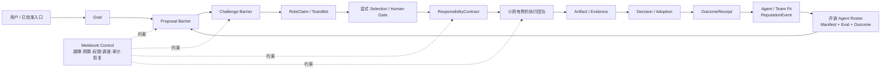

# Meldwork Harness Engine：协议治理的 Agent 组织层

> 2026-09-08 范围说明：本文保留为长期架构选项，不代表当前路线或实施承诺。近期优先级以[产品战略](product-strategy.md)与[迭代计划](product-iteration-plan.md)为准；动态竞案、组队及 Outcome Network 尚无付费验证，不要求每项任务执行本文完整流程。

> 日期：2026-08-14
>
> 状态：产品与技术战略，不代表当前已交付能力
> 关联文档：[产品迭代规划](product-iteration-plan.md)、[产品战略](product-strategy.md)、[架构](../architecture.md)、[自动化边界](automation.md)、[评测](eval-harness.md)

## 0. 结论

Meldwork 不应退化为一个隐藏决策过程的中央 Planner 或 Router。目标架构是：

> **一个 protocol-governed organization layer：让开放、可替换的 Agent workforce 在显式协议、责任、预算、权限和证据约束下，为一项 Goal 形成小而有界的执行团队。**

系统负责屏障、预算、权限、调度、审计和恢复；Agent 负责提出方案、挑战假设、声明能力和履行责任；人或预先批准的 Policy 负责选择方案、批准高风险动作和采用结果。Meldwork 必须保留候选方案、异议、选择理由和未解决风险，不能用不透明路由隐藏解空间。

长期链路是：

```text
Goal
  -> Proposal Arena
  -> RoleClaim / TeamBid
  -> ResponsibilityContract
  -> Bounded Execution
  -> Artifact / Evidence
  -> Decision / Adoption
  -> OutcomeReceipt / ReputationEvent
```

开放的是候选 workforce，不是每次运行的团队规模。默认一个 Agent；需要独立方案时使用 2-4 个 Proposal；执行团队通常保持 1-3 个责任主体，并按风险增加独立 Verifier。超过上限必须说明质量、风险或交付时间收益。

## 1. Today / Next / Future 边界

| 层次 | 可以承诺什么 | 不能暗示什么 |
| --- | --- | --- |
| **Today** | Local-first Electron 工作空间；发现并受控调用已支持的本地 Agent CLI；直接/群组会话；兼容条件下的原生 Session 延续；显式目标、上下文和写入权限；有界自动讨论、停止、失败状态和脱敏运行轨迹 | 已有 Proposal Arena、自动选人、动态组队、完整 Outcome 闭环、生产级远程/Cloud/Channel 或企业治理 |
| **Next** | 90 天真实任务验证；最小 Task/Artifact/Evidence/Decision/Adoption；独立 Proposal、Challenge 和用户选择协议 | V4 已实现，或多 Agent 必然优于最佳单 Agent |
| **Future** | Team Formation、Responsibility Contract、Agent/Team Fit、可扩展 roster、远程适配、企业治理和 Outcome Network | 无条件自治、无限 Agent、公开共享用户工作数据或已形成网络效应 |

根 README、GitHub Description 和默认 Banner 的品牌 headline 可以表达长期方向，但紧随其后的正文必须明确当前 Work Cell 边界。Proposal Arena 可以标为 Next；Team Formation、远程能力和 Outcome Network 必须标为 Future 或 Product direction，不能写成已交付机制。未来 Harness 图若用于公开页面，应明显区分当前实线能力与未来虚线能力。

## 2. 协议对象

| 对象 | 定义 | 必须保留的字段或边界 |
| --- | --- | --- |
| **Goal** | 经用户确认的工作目标 | 背景、约束、验收标准、风险、预算、允许的数据和截止条件 |
| **Proposal** | Agent 对 Goal 提交的独立解决方案 | 方法、假设、预期 Artifact、所需工具/权限、Evidence 计划、成本/时间估计、置信度和风险 |
| **Challenge** | 对某个 Proposal 的可定位质询 | 被挑战的假设、缺失 Evidence、反例、替代方案或不可接受风险；不能改写原 Proposal |
| **RoleClaim** | Agent 对某项责任的能力声明 | 角色、适用范围、能力证据、版本、限制、预算和退出条件；声明不等于自动获得任务 |
| **TeamBid** | 一个候选小团队对 Goal 的协作报价 | 成员、角色、依赖、交接、总预算、预计耗时、风险和责任合同草案 |
| **ResponsibilityContract** | 被选中团队的显式责任约定 | 谁负责什么输入、Artifact、Evidence、权限、预算、Human Gate、停止条件、失败交接和单写交付者 |
| **Artifact** | 可被继续使用的交付物 | 类型、版本、责任主体、来源 Task/Run 和可导出位置 |
| **Evidence** | 支持或反驳 Artifact、Proposal 或 Decision 的依据 | 来源、观察方式、适用范围及 `Declared / Observed / Reproduced / Human accepted` 状态 |
| **Decision** | 对方案、风险或产物作出的显式选择 | 选择、拒绝、要求修订、接受风险、选择理由和未解决异议 |
| **Adoption** | Artifact 被实际使用 | Apply、Commit、Export、发送、进入后续任务或其他可验证使用行为 |
| **OutcomeReceipt** | 一次 Goal 的不可含混结果回执 | 选中与落选方案、责任合同、Artifact、Evidence、Decision、Adoption、成本、耗时、失败与恢复 |
| **ReputationEvent** | 从 OutcomeReceipt 派生的情境化能力事件 | Goal/领域、Agent/Team/Connector 及版本、正负贡献、证据强度和隐私范围；不得压成一个永久全局分数 |

Outcome 数据从第一天积累。失败、拒绝、取消和回滚同样生成 OutcomeReceipt；否则 Fit 数据只会记录成功样本并误导后续选择。默认保存在本地，只有用户单独同意时，才上传不含 Prompt、原文、Artifact、Secret 和个人身份的最小派生指标。

## 3. 协议治理架构



### 3.1 系统拥有的责任

- 在任何调度租约前冻结共享 Goal、Context Pack 和每个候选者的交付要求。
- 对独立 Proposal 使用批次屏障；屏障前不得让后发 Agent 看到先发结论，屏障后按稳定顺序发布。
- 对 Challenge 使用定向分配，不传播原始思维过程，只共享 Proposal、Evidence 和必要上下文。
- 显示候选 shortlist、资格依据、排除原因、排队状态和预算影响，不进行不可解释的静默选人。
- 执行预算、权限、并发、超时、取消、重试、Checkpoint、Human Gate 和恢复。
- 对同一 Workspace 保持“并发思考，单写交付”；并发写入必须先有隔离 Workspace 和可验证合并协议。
- 持久化协议对象和脱敏事件，不暴露 raw chain-of-thought、Secret、任意命令或不受限 stdout/stderr。

### 3.2 Agent 和人拥有的责任

- Agent 可以提出不同 Proposal、Challenge、RoleClaim 和 TeamBid，但不能自行扩大权限或预算。
- Agent 只能在 ResponsibilityContract 指定的范围内执行，超出范围必须产生 Gate。
- 人或预先批准的 Policy 选择方案与团队；选择理由和落选方案仍可审计。
- 最终 Adoption 由真实使用行为决定，不能由 Agent 自报“已完成”或“已达成共识”替代。

## 4. 从开放 workforce 到 Outcome Network

### 4.1 Proposal Arena

Proposal Arena 先竞争解决方案，不竞争发言数量。每个 Proposal 使用相同冻结 Goal 独立形成；Challenge 只指出缺口、反例或替代方案；用户或明确规则决定哪个方案进入执行。

价值必须通过盲评、返工、风险发现、成本和等待时间相对最佳单 Agent 基线来证明。若质量提升低于 10%，同时成本超过 2.5 倍，应停止扩大 Arena，保留单 Agent + Reviewer。

### 4.2 Team Formation 与 Responsibility

Team Formation 不是中央系统私下拆任务，而是候选 Agent 提交 RoleClaim/TeamBid，系统展示依据，人或 Policy 选择一个小团队并签订 ResponsibilityContract。团队规模、写入者、Evidence、预算、退出和接管条件必须在执行前确定。

### 4.3 Agent Labor Market：证据化 roster，而非 Token 市场

Meldwork 的 Agent Labor Market 应先表现为开放、可认证、可比较的 workforce：社区可以贡献 Connector，Agent 和团队依靠任务情境中的 OutcomeReceipt 获得 Fit 证据。近期不做 Token 加价、竞价排名或无证据的全局排行榜。

一个候选者只有在 Manifest、权限、版本、取消/恢复、Artifact/Evidence 和固定 Eval 上合格后，才进入可选 roster。Fit 辅助 shortlist，但必须显示证据、样本量、成本、限制和回退选择。

### 4.4 Agent Organization OS

当同一 ResponsibilityContract 被多个用户重复采用后，Meldwork 才把它升级为可版本化组织协议：角色、Policy、预算、Human Gate、失败交接、兼容矩阵和 Outcome 标准。它管理的是责任与结果，不是模拟公司职位或让 Agent 无限自治。

### 4.5 Outcome Network

Outcome Network 不是最后才开始采集的社交图。它从首个 OutcomeReceipt 起积累 `Goal -> Proposal -> Team -> Artifact -> Evidence -> Decision -> Adoption` 关系，未来只有在数据量、授权和实际路由提升成立后，才产品化为跨任务复用、Agent/Team Fit 和组织治理能力。

成功指标是历史 Outcome 是否提高后续选择质量、复用率和留存，而不是图节点数量。

## 5. 当前基础与尚未交付

当前代码已经提供本地信任边界、受控 CLI 调用、Agent-specific Session、显式权限、停止与失败状态、脱敏 Run Ledger、有限 Evidence Capsule、Skill/附件上下文及知识来源选择。这些能力可以支撑协议演进，但当前持久化和交互中心仍主要是 Conversation。

以下均属于尚未交付：

- 完整的上述协议对象及端到端 OutcomeReceipt。
- 独立 Proposal 批次、Challenge 批次、动态 TeamBid 和 ResponsibilityContract。
- 基于真实 Outcome 的自动 Fit、scalable roster 或 Agent Labor Market。
- 生产级远程/Cloud/Channel Adapter、无人值守组织协议和 Outcome Network。

V4 并发协作仍是设计方向，不能写入 Today 的 README、Release 或 GitHub Description。

## 6. 架构演进门槛

| 阶段 | 架构解锁 | 必须证明的结果 |
| --- | --- | --- |
| 90 天验证 | 最小 OutcomeReceipt 和单 Agent/有界复核基线 | 真实 Adoption、30 天重复使用、协调时间下降和标准化付费意愿 |
| Proposal Arena | Proposal/Challenge 屏障和显式 Selection | 盲评质量、关键风险发现或返工相对基线改善，且成本可接受 |
| Team Formation / Responsibility | RoleClaim、TeamBid、ResponsibilityContract | 小团队重复完成同类 Goal，责任清楚、人工协调下降、失败可接管 |
| Agent/Team Fit + scalable roster | Connector 认证、ReputationEvent、可解释 shortlist | roster 扩大时，单次团队规模、支持成本和失败率不随之失控；Fit 优于默认选择 |
| Remote / Cloud / CLI / Channel Adapter | 统一 Adapter 生命周期、幂等交付和出站审批 | 真实重复需求、零未授权副作用、可解释失败和付费续用 |
| Enterprise Governance / Outcome Network | 共享 Policy、RBAC、审计、隐私保护的 Outcome 派生数据 | 多个团队为同一标准能力付费；Outcome 数据提高复用、选择质量或留存 |

详细时间窗、进入/退出门和停止条件见[产品迭代规划](product-iteration-plan.md)。

## 7. 商业化原则

优先 ICP 是已经同时使用两种以上 Agent、且每周重复交付代码或证据型报告的小团队。客户为更低协调成本、更少返工、更可靠 Evidence、可治理责任和兼容支持付费，不为 Agent 数量付费。

- 先用同一标准化 Goal/ResponsibilityContract 做设计伙伴和付费 Pilot，不以定制 Connector 收入冒充产品验证。
- BYO Agent、Provider 和 Knowledge 为默认，不通过 Token 加价制造收入。
- 进入企业阶段前，至少 3 个团队应为同一标准化能力付费，且支持成本持续下降。
- 服务需求只有能被至少 3 个相似客户复用时才进入核心产品。

## 8. 停止条件

| 观察 | 决策 |
| --- | --- |
| 15 名固定用户中少于 8 名产生 30 天重复 Outcome | 不扩展 Team、Cloud 或 roster，先修激活和 Outcome 闭环 |
| Proposal Arena 质量提升低于 10%，且成本超过最佳单 Agent 2.5 倍 | 停止扩大多 Agent，保留单 Agent + 独立 Reviewer |
| Connector 维护连续两个月占核心团队时间超过 30% | 收缩认证列表，优先协议原生和社区维护 Connector |
| 超过 50% Pilot 收入来自不可复用定制 | 不进入 Agent Organization OS，重新定义为服务业务或停止该方向 |
| 出现 Secret 泄漏、未授权写入或无法可靠取消 | 暂停远程、无人值守和企业销售，先修信任边界 |
| Outcome 数据不能改善 Fit、复用或留存 | 不建设 Outcome Network 产品面，只保留本地审计记录 |

## 9. 明确不做

- 以支持 Agent 数量、消息数、轮数或运行时长作为成功指标。
- 用中央 Planner 隐藏候选方案、替用户决定解空间或伪造共识。
- 默认全 roster 参会、无限轮次或无预算 Swarm。
- 在 Outcome 与付费门槛成立前建设重型云平台、多租户系统或 Token Marketplace。
- 将用户原始 Prompt、Artifact、知识内容或 Secret 默认汇入共享网络。
- 为单一客户长期维护核心代码分叉。

## 10. 主要依据

- Anthropic：[Building effective agents](https://www.anthropic.com/research/building-effective-agents)
- Anthropic：[How we built our multi-agent research system](https://www.anthropic.com/engineering/multi-agent-research-system)
- Kim et al.：[Towards a Science of Scaling Agent Systems](https://arxiv.org/abs/2512.08296v3)
- [Model Context Protocol](https://modelcontextprotocol.io/docs/getting-started/intro)
- [Agent Client Protocol](https://agentclientprotocol.com/get-started/introduction)
- [Agent2Agent Protocol](https://a2a-protocol.org/latest/)

这些资料支持“按任务结构选择协作模式、显式控制成本与责任”的原则，不证明 Meldwork 的未来机制已经交付或商业结果已经成立。
